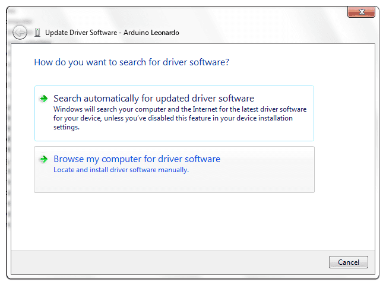
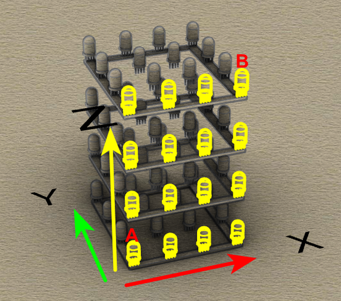
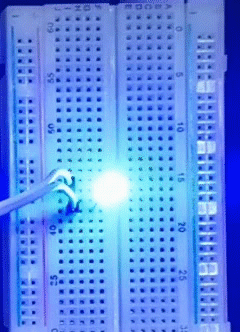

# Arduino Tutorial

## 1.Software Installation

Please refer to: https://arduinoide.readthedocs.io

------

Manually Install Drivers on Windows:https://docs.arduino.cc/tutorials/generic/DriverInstallation

The following instructions are for Windows 7, Vista and 10. They are  valid also for Windows XP, with small differences in the dialog windows. In the following instruction only the Leonardo board will be mentioned, but the same procedure is valid for all the Arduino boards.

Plug  in your board and wait for Windows to begin its driver installation  process. If the installer does not launch automatically, navigate to the Windows Device Manager (Start>Control Panel>Hardware) and find  the Arduino Leonardo listing. Right click and choose **Update driver**.


At the next screen, choose "Browse my computer for driver software", and click **Next**.



Click the **Browse...** button. Another dialog appears: navigate to the folder with the Arduino software that you just downloaded. Select the **drivers** folder an click **OK**, then click **Next**.


You will receive a notification that the board has not passed Windows Logo testing. Click on the button **Continue Anyway**.


After a few moments, a window will tell you the wizard has finished installing software for Arduino Leonardo. Press the **Close** button.

------

------


## 2.Projects

### 2.1. Startup: An Adventure in The World of Light


------

In this project, we will guide you to explore the fantastic cube on its structure, working principle and applications. Now build your cube to get your journey started! 

------


#### Brief Introduction: What Is An RGB Cube? 

A 4x4x4 RGB Cube consists of 64 RGB (tricolor of red, green and blue) LED and their drive circuits, a microcontroller(MCU), and its transparent housing (acrylic board usually). Each LED, separately, emits any color in RGB, hence polychrome patterns and colorful shows can be devised with your creativity through different color combinations. 


------


#### Basic Construction: What Is The Cube Composed?

RGB Cube integrates ATmega32u4 as its main control chip at the bottom to control all 64 RGB LED, whose using method is entirely the same as the Leonardo development board. 


[How to Get A Leonardo Development Board]:https://www.keyestudio.com/products/keyestudio-atmega32u4-leonardo-r3-development-board-1m-micro-usb-cable-for-diy-project


This cube consists of totally 4x4x4=64 LED.


To expatiate, four 4x4 matrix are piled one above another to form a 3D Cube. Still, each sole RGB LED can be controlled to light up in planed colors. 


Similarly, each matrix can also work separately.


Certainly, you can choose to light up all RGB LED on the cube. 


----------------------


#### Working Principle: How Does The Cube Work?

For short, all the RGB LED and their colors' permutation and combination are controlled by an MCU.


Due to the considerable RGB LED, it is unrealistic to control them via IO pin on mainboard one by one. By comparison, a drive circuit satisfies the need --- it is called MCU 32U4+MY9262 Driver Module.


With 32U4, data is transmitted to the driver module to run commands of lighting up each RGB LED, so that the cube is in a light show. 


------


#### Unlimited Ingenuity!

In this project, we get a preliminary understanding of the concept, composition and working principle of the cube, which lays a solid foundation for the following exploration and originality!

Next, please continue your learning on its applications and operational skills! Whether you are a beginner or an experienced developer, learning Arduino will be very joyful and challenging. 

Let’s keep going!


------

### 2.2.Shining Journey: A Unique Cube


---------

First of all, you will learn Arduino programming to know how to light up LED lights and to control the cube via code. Implementing simple light shows, gives you the foundation to explore more creative control methods.

------


#### First Experience: Light Up The Cube

##### Background Knowledge

In terms of hardware, it communicates with the driver module through the 32U4 main control chip to control 64 RGB LED, which simplifies the IO pins on the main control chip.


**The operation guide of driver module MY9262:**


------

**Communication Command:**

|    Instruction Name    | Number of DCK Pulses when LAT is at High | Function Description                                         |
| :--------------------: | :--------------------------------------: | :----------------------------------------------------------- |
|       Data Latch       |                  0 or 1                  | Strobes image data into temporary registers. In this time, constant current outputs are not updated to a new frame data. |
|      Global Latch      |                  2 or 3                  | Strobes image data from temporary registers   into an APDM/PWM generator. In this time, constant current outputs are updated to a new  frame data. |
|    Reading Command     |                  4 or 5                  | Read out command data from the command latch cell to the 16bits shift registers. And thecommand data could shift out from DO pin by  serial DCK pulses. |
|    Writing Command     |                 10 or 11                 | Strobes command data from the 16bits shift register into the command latch cell. Note that this instruction must follow by the “Enable Writing Command” instruction. |
| Reset APDM/PWM Counter |                 12 or 13                 | This instruction will reset APDM/PWM counter to synchronize a new frame if CMD[11]=”H”. |
| Enable Writing Command |                 14 or 15                 | This instruction enables the “Writing Command”instruction. This instruction should be executed before the “Writing Command” instruction every time. |

-----------

**Command Operation:**

- Data Latch ：

  

- Global Latch ：

  

- Reading Command: 

  

- Writing Command: 

  

- Reset APDM/PWM Counter (set CMD[11]=”1”): 

  
  

--------------

**Command Data Format:**


------

**Data Bit:**


------

**Image Data Format:**


------

**Data Transmitting Protocol:**

- **MODE0** ( CMD[15]=“0” ) 

  

- **MODE1** ( CMD[15]=“1” ) 

  
  

---------

**Data Synchronization:**

- **Auto Synchronization** ( CMD[10]=“0” )

  

- **Manual Synchronization** ( CMD[10]=“1” )

  

-------

On the basis the previous theory, data will be sent according to the register information of MY9262, and that is how the driver module communicate. For beginners, libraries and tutorials are provided to make operations easier.

------

##### Description of Library

- Click Skerch > Include Library > Add .Zip Library... 

  .png)

- Select and click the library file(zip. format) you need to add as library. Download link：https://fs.keyestudio.com/KS0575

  

- The massage bar will display “Library installed” if the file is successfully upload.

  .png)

Open Arduino IDE to import the Cube libraries. 

- Include the library and initialize.

  ```c++
  #include "SPI.h"
  #include <Cube.h>
  
  Cube cube;
  ```

- Initialize the serial port in the **setup()** function.

  ```c++
  void setup() {
    // Serial port options for control of the Cube using serial commands are:
    // 0: Control via the USB connector (most common).
    // 1: Control via the RXD and TXD pins on the main board.
    // -1: Don't attach any serial port to interact with the Cube.120
    cube.begin(0, 115200); // Start on serial port 0 (USB) at 115200 baud
  }
  ```

- Put the functions that operate on the cube in the **loop**.

  - Axis x, y, and z:


- Light up all RGB LED.

  ```c++
  //RGB(red, green, blue);
  cube.all(RGB(0xff, 0xf0, 0x0f));
  ```

- Light up RGB LED according to axis.

  ```c++
  //set(axis x, y, z, RGB(0xff, 0xf0, 0x0f));
  cube.set(0, 0, 0, RGB(0xff, 0xf0, 0x0f));
  ```
  

- Light up RGB LED from 0 to 64.

  ```c++
  cube.next(RGB(0x0f, 0xf0, 0x0f));
  ```

- By line segments: Given positions of Point A and B, the RGB LED between A and B will light up.

  ```c++
  //line(byte x1, byte y1, byte z1, byte x2, byte y2, byte z2, rgb_t rgb);
  cube.line(0, 0, 0, 0, 0, 0, RGB(0x0f, 0xf0, 0x0f));
  ```

  

- By solid squares: Given positions of Point A and B.

  ```c++
  //void box(byte x1, byte y1, byte z1, byte x2, byte y2, byte z2, rgb_t rgb);
    cube.box(0, 0, 0, 3, 3, 3, RGB(0x0f, 0xf0, 0x0f));
  ```

  - Result 1: If A and B are at the diagonal corners in the same plane, light up a 4x4 matrix, as show below.

    

  - Result 2: If A and B are at the diagonal corners of the cube, light up all RGB LED, as shown below.

    

- Given the position of Point A as a center, draw a sphere with a variable size.

  NOTE: The sphere will not show up if its size is too big or small.

  ```c++
  //sphere( x1, y1, z1, size, rgb_t rgb);
  cube.sphere(2, 1, 2, 3, RGB(0x0f, 0xf0, 0x0f));
  ```

  

- Define axis and four planes A, B, C, and D, and light up RGB LED according to these planes.

  NOTE: **copyplane** and **moveplane** function can set only two planes at one time, yet the cube contains four planes, thus we need to adopt them in combination. 

  ```c++
  //cube.copyplane(Axis（0~2）, Plane A（0~3）, Plane B（0~3）);
  cube.copyplane(0, 0, 2);
  //cube.moveplane(Axis（0~2）, Plane C（0~3）, Plane D（0~3）, RGB(0x0f, 0xf0, 0x0f));
  cube.moveplane(0, 0, 3, RGB(0x0f, 0xf0, 0x0f));
  ```

  

------


#### Lighting-up Codes

##### Given The Start Point, Light Up Only One RGB LED. 

```c++
#include "SPI.h"
#include "Cube.h"

Cube cube;

void setup() {
  // Serial port options for control of the Cube using serial commands are:
  // 0: Control via the USB connector (most common).
  // 1: Control via the RXD and TXD pins on the main board.
  // -1: Don't attach any serial port to interact with the Cube.
  cube.begin(0, 115200); // Start on serial port 0 (USB) at 115200 baud
}

void loop() {
  //set 0 0 0 The Start Point as red
  cube.set(0, 0, 0, RED);
  delay(500);
  //Turn off all RGB LED, NOTE: When lights out, it only can turn off all RGB LED rather than only one of them.
  cube.all(BLACK);
  delay(500);
}
```

##### All RGB LED blinks.

```c++
#include "SPI.h"
#include "Cube.h"

Cube cube;

void setup() {
  // Serial port options for control of the Cube using serial commands are:
  // 0: Control via the USB connector (most common).
  // 1: Control via the RXD and TXD pins on the main board.
  // -1: Don't attach any serial port to interact with the Cube.
  cube.begin(0, 115200); // Start on serial port 0 (USB) at 115200 baud
}

void loop() {

  //Set all RGB LED to red
  cube.all(RED);
  delay(1000);
  //Turn off all RGB LED, NOTE: When lights out, it only can turn off all RGB LED rather than only one of them.
  cube.all(BLACK);
  delay(1000);
  
}

```

##### Key Words of Color.

```c++
#define RGB(red, green, blue) (rgb_t) { red, green, blue }

#define BLACK  RGB(0x00, 0x00, 0x00)
#define BLUE   RGB(0x00, 0x00, 0xff)
#define GREEN  RGB(0x00, 0xff, 0x00)
#define ORANGE RGB(0xff, 0x45, 0x00)
#define PINK   RGB(0xff, 0x14, 0x44)
#define PURPLE RGB(0xff, 0x00, 0xff)
#define RED    RGB(0xff, 0x00, 0x00)
#define WHITE  RGB(0xff, 0xff, 0xff)
#define YELLOW RGB(0xff, 0xff, 0x00)
    
//Key words that can be directly called in codes:
//For example:
cube.all(BLACK);
cube.all(BLUE);
cube.all(GREEN);
cube.all(ORANGE);
cube.all(PINK);
cube.all(PURPLE);
cube.all(RED);
cube.all(WHITE);
cube.all(YELLOW);
    
```


----------------


#### Light Show Codes

##### Water Flow LED on One Axis

```c++
#include "SPI.h"
#include "Cube.h"

Cube cube;

void setup() {
  // Serial port options for control of the Cube using serial commands are:
  // 0: Control via the USB connector (most common).
  // 1: Control via the RXD and TXD pins on the main board.
  // -1: Don't attach any serial port to interact with the Cube.
  cube.begin(0, 115200); // Start on serial port 0 (USB) at 115200 baud
}

void loop() {
  int value = 0;
  //X axis
  for(int x = 0; x <= 3; x++){
    cube.set(x, 0, 0, BLUE);
    delay(500);
    //Turn off all RGB LED, NOTE: When lights out, it only can turn off all RGB LED rather than only one of them.
    cube.all(BLACK);
    delay(500);
  }
  //Y axis
  for(int y = 0; y <= 3; y++){
    cube.set(0, y, 0, BLUE);
    delay(500);
    //Turn off all RGB LED, NOTE: When lights out, it only can turn off all RGB LED rather than only one of them.
    cube.all(BLACK);
    delay(500);
  }
  //Z axis
  for(int z = 0; z <= 3; z++){
    cube.set(0, 0, z, BLUE);
    delay(500);
    //Turn off all RGB LED, NOTE: When lights out, it only can turn off all RGB LED rather than only one of them.
    cube.all(BLACK);
    delay(500);
  }
}

```

##### Water Flow LED on One Plane

```c++
#include "SPI.h"
#include "Cube.h"

Cube cube;

void setup() {
  // Serial port options for control of the Cube using serial commands are:
  // 0: Control via the USB connector (most common).
  // 1: Control via the RXD and TXD pins on the main board.
  // -1: Don't attach any serial port to interact with the Cube.
  cube.begin(0, 115200); // Start on serial port 0 (USB) at 115200 baud
}

void loop() {
  int x = 0;
  int y = 0;
  int z = 0;
  
  //X axis
  for (int i = 0; i < 4; i++){
    //cube.line lights up an RGB LED line from Point A to B
    //in cube.line, the first three xyz is A, and the last three xyz is B
    cube.line(x, y, z, x, y, z + 3, RED);
    x++;
    if(x > 4){
      x = 0;
    }
    delay(200);
  }
  cube.all(BLACK);
  delay(200);

  //Y axis
  x = 0;
  y = 0;
  z = 0;
  for (int i = 0; i < 4; i++){
    //cube.line lights up an RGB LED line from Point A to B
    //in cube.line, the first three xyz is A, and the last three xyz is B
    cube.line(x, y, z, x, y, z + 3, RED);
    y++;
    if(y > 4){
      y = 0;
    }
    delay(200);
  }
  cube.all(BLACK);
  delay(200);
  
  //Z axis
  x = 0;
  y = 0;
  z = 0;
  for (int i = 0; i < 4; i++){
    //cube.line lights up an RGB LED line from Point A to B
    //in cube.line, the first three xyz is A, and the last three xyz is B
    cube.line(x, y, z, x + 3, y, z, RED);
    z++;
    if(z > 4){
      z = 0;
    }
    delay(200);
  }
  cube.all(BLACK);
  delay(200);
}

```


------


#### Deep Experience: Light Up Cubes

**Cascading interfaces are reserved on the cube, which can connect multiple cubes in series. In cascade mode, only one cube is the master device that controls lights, while others are slave ones that need to clear codes and are not allowed to run codes, otherwise tests are with no results). **

The cascading interface, as follows, can be quickly connect via pins and connectors.

NOTE: Each cube contains many RGB LED and then loads a large voltage. Therefore, when multiple cubes are cascaded, please provide independent power supply to each to ensure stable operation of the system.


Two cubes are cascaded as follows:


------


#### FAQ

##### Q: How to determine the axis X, Y, and Z on the RGB Cube?

A: The direction of the X and Y axis is marked on the main control board, and the Z axis is perpendicular to them.


##### Q: With multiple RGB Cube connected, error occurs.

A: The master RGB Cube is used to control the lights. Please clear their codes in other connected Cubes.


-----------------------------

### 2.3.Magical Fingertip: Button And Light


---------

In this project, a button module is integrated with this cube to control lights through programming, and codes will be written according to the working principle of this button module. With an external button, you may enjoy more joy and feel more involved in the entire experiment, and you will take sophisticated controlling methods much easier with the experience of this lesson. 

------


#### A Button Module

##### Description

**Button module** is a simple input device whose power level is read by the MCU to determine its state (being pressed or released).


##### **Principle Diagram**


##### **Parameters**

- Voltage: 3~5V
- Current: ≤1.1mA
- Power: ≤5.5mW


**The button works due to a built-in ON/OFF circuit. **

- **When the button is pressed,** the circuit is closed(ON state) so that current passes from the button to GND, and a low power level is detected at the digital input pin on the development board. 
- **When the button is released,** the circuit is opened(OFF state) and the power level is pulled up by a resistor, thus the digital input pin detects a high level. 


------


#### Wiring Diagram

Hold your RGB CUBE and look for the expansion interface at its bottom. Connect the wire to D6 pin. 

**NOTE: S(Signal) is in yellow, V(Voltage) is in red, GND is in black. When wiring, please pay attention to the color and do not reverse!**


------


#### Code

Upload the code to the development board. 

```c++
#define ButtonPin 6 //Define the button pin

void setup() {
  //Initialize the serial port and set to 9600
  Serial.begin(9600);
  //Set the pin to input mode
  pinMode(ButtonPin,INPUT);
}

void loop() {
  //Define a value to store the read button value
  int ReadValue = digitalRead(ButtonPin); 
  //Print the value on the serial port
  Serial.print("The current status of the button is : ");
  Serial.println(ReadValue);
  delay(500);
}
```

Open the serial monitor and set the corresponding baud rate. 

- When the button is pressed, the serial port prints 0.
- When the button is released, the serial port prints 1. 


------


#### Expansion

**Self-locking Button**

A self-locking button will not pop up after you pressing it until you press it again, which is very similar to a switch. We adopt MCU to control the state of the circuit, and we reform the common button into a self-locking one via coding. 

Open Arduino IDE, choose the correct development board and COM port, and upload the code to the board. 

Code: 

```c++
#define ButtonPin 6 //Define a button pin
int value = 0;      //Define a value to determine the button value

void setup() {
  //Initialize the serial port and set the baud rate to 9600
  Serial.begin(9600);
  //Set the pin mode to input
  pinMode(ButtonPin,INPUT);
}

void loop() {
  //Define a value to store the button value
  int ReadValue = digitalRead(ButtonPin); 
  //Determine whether the value is pressed
  if (ReadValue == 0) {
    //eliminate the button jitter
    delay(10);  
    if (ReadValue == 0) {
      value = !value;
      Serial.print("The current status of the button is : ");
      Serial.println(value);
    }
    //Again, determine whether the button is still pressed
    //Pressed: execute the loop; Released: exit the loop to run next code
    while (digitalRead(ButtonPin) == 0); 
  }
}

```

After uploading code, open the serial monitor. 

Press the button once and the monitor prints 1; Press again it prints 0. Now it becomes a self-locking button! 


------


#### Button Switches Light


##### Light Color Change

Press the button to shift the overall color of the cube. 

```c++
#include "SPI.h"
#include "Cube.h"

#define ButtonPin 6 //Define the button pin

Cube cube;

int value = 0;      //Define a value to determine the button value
int count = 0;      //Define a loop count

void setup() {
  // Serial port options for control of the Cube using serial commands are:
  // 0: Control via the USB connector (most common).
  // 1: Control via the RXD and TXD pins on the main board.
  // -1: Don't attach any serial port to interact with the Cube.
  cube.begin(0, 115200); // Start on serial port 0 (USB) at 115200 baud
  //Set the pin mode to input
  pinMode(ButtonPin,INPUT);
}

void loop() {
  //Define a value to store the read button value
  int ReadValue = digitalRead(ButtonPin); 
  //Determine whether the button is pressed
  if (ReadValue == 0) {
    //Eliminate the button jitter
    delay(10);  
    if (ReadValue == 0) {
      value = !value;
      //Ternary arithmetic
      //If count is greater than 3, count = 0
      //If count is smaller than 3, count + 1
      count = count > 3 ? 0 : count + 1;
      Serial.print("The current status of the button is : ");
      Serial.println(value);
      Serial.println(count);
    }
    //Again, determine whether the button is still pressed
    //Pressed: execute the loop; Released: exit the loop to run next code
    while (digitalRead(ButtonPin) == 0); 
  }
  if (count == 0) {
    cube.all(RED);
  }
  else if (count == 1){
    cube.all(BLUE);
  }
  else if (count == 2){
    cube.all(GREEN);
  }
  else if (count == 3){
    cube.all(WHITE);
  }
  else if (count == 4){
    cube.all(BLACK);
  }
}

```


**Explanation about Ternary Arithmetic**

If a person is 18 years old or older, output "Adult", or else, output "Adolescent". This can be expressed in C language in ternary arithmetic as follows:

```c++
    int age = 20;
    char status = (age >= 18) ? "Adult" : "Adolescent";
    Serial.println(status);
```

In the above example, if the condition `(age >= 18)` is true, the computational results will be "Adult". Otherwise, it will be "Adolescent". Then, `Serial.println` function will output the results. 


------


##### Water Flow LED Change

```c++
#include "SPI.h"
#include "Cube.h"

#define ButtonPin 6 //Define the button pin

Cube cube;

int value = 0;      //Define a value to determine the button value
int count = 0;      //Define a loop count

void setup() {
    // Serial port options for control of the Cube using serial commands are:
  // 0: Control via the USB connector (most common).
  // 1: Control via the RXD and TXD pins on the main board.
  // -1: Don't attach any serial port to interact with the Cube.
  cube.begin(0, 115200); // Start on serial port 0 (USB) at 115200 baud
  //Set the pin mode to input
  pinMode(ButtonPin,INPUT);
}

void loop() {
  //Defien a value to store the button value
  int ReadValue = digitalRead(ButtonPin); 
  //Determine whether the button is pressed
  if (ReadValue == 0) {
    //Eliminate the button jitter
    delay(10);  
    if (ReadValue == 0) {
      value = !value;
      //Accumulate count and cycle it within 0-2
      //Ternary arithmetic
      //If count is greater than 3, count = 0
      //If count is smaller than 3, count + 1
      count = count > 2 ? 0 : count + 1;
      Serial.print("The current status of the button is : ");
      Serial.println(value);
      Serial.println(count);
    }
    //Again, determine whether the button is still pressed
    //Pressed: execute the loop; Released: exit the loop to run next code
    while (digitalRead(ButtonPin) == 0); 
  }
  //When count = 0, water flow light in axis x
  //When count = 1, water flow light in axis y
  //When count = 2, water flow light in axis z
  xaxis(count);
  yaxis(count);
  zaxis(count);

}

//water flow light in axis X
void xaxis(int count){
  int x = 0;
  int y = 0;
  int z = 0;
  //
  if (count == 0) {
    for (int i = 0; i < 4; i++){
      cube.line(x, y, z, x, y , z + 3, YELLOW);
      cube.line(x, y + 1, z, x, y + 1, z + 3, GREEN);
      cube.line(x, y + 2, z, x, y + 2, z + 3, RED);
      cube.line(x, y + 3, z, x, y + 3, z + 3, WHITE);
      x++;
      if(x > 4){
        x = 0;
      }
      delay(200);
    }
    cube.all(BLACK);
  }
}

//water flow light in axis y
void yaxis(int count){
  int x = 0;
  int y = 0;
  int z = 0;
  if(count == 1){
    for (int i = 0; i < 4; i++){
      cube.line(x, y, z, x, y, z + 3, PURPLE);
      cube.line(x + 1, y, z, x + 1, y, z + 3, PINK);
      cube.line(x + 2, y, z, x + 2, y, z + 3, BLUE);
      cube.line(x + 3, y, z, x + 3, y, z + 3, WHITE);
      y++;
      if(y > 4){
        y = 0;
      }
      delay(200);
    }
    cube.all(BLACK);
  }
}

//water flow light in axis z
void zaxis(int count){
  int x = 0;
  int y = 0;
  int z = 0;
  if (count == 2){
    for (int i = 0; i < 4; i++){
      cube.line(x, y, z, x + 3, y, z, BLUE);
      cube.line(x, y + 1, z, x + 3, y + 1, z, RED);
      cube.line(x, y + 2, z, x + 3, y + 2, z, ORANGE);
      cube.line(x, y + 3, z, x + 3, y + 3, z, PURPLE);
      z++;
      if(z > 4){
        z = 0;
      }
      delay(200);
    }
    cube.all(BLACK);
  }
}

```


------


#### FAQ

##### Q: RGB Cube detects the button in a poor sensibility. 

A: Try to modify the delay time of jitter elimination to an appropriate time.

```c++
//Determine whether the button is pressed
  if (ReadValue == 0) {
    //Eliminate the button jitter
    delay(10);  
  }
```


##### Q: Serial monitor does not print values.

A: 

1. Please check whether the serial port is correct. 

2. Please check whether the baud rate is consistent with that in the code.

3. Re-plug the USB cable. 


------

### 2.4.Symphony of Colors: Innovation in Art of Light

------

**TARGET:** We will learn how to design and innovate the light effects and how to fade, blink and circulate light color.

------


#### Charm of Fading Color

##### Fade RGB LED

To fade an LED, we control the gradual change of LED brightness through the PWM output by the MCU. 



**Pulse Width Modulation (PWM)**, is an effective technology using the MCU digital output to control analog circuits, which is applied to many fields, including measurement, communication as well as power control and conversion.

**Pulse Width Modulation**

Pulse  Width Modulation, or PWM, is a technique for getting analog results with digital means. Digital control is used to create a square wave, a  signal switched between on and off. This on-off pattern can simulate  voltages in between the full VCC of the board (e.g., 5 V on UNO, 3.3 V  on a MKR board) and off (0 Volts) by changing the portion of the time  the signal spends on versus the time that the signal spends off. The duration of "on time" is called the pulse width. To get varying analog  values, you change, or modulate, that pulse width. If you repeat this  on-off pattern fast enough with an LED for example, the result is as if  the signal is a steady voltage between 0 and VCC controlling the  brightness of the LED.

Official Website: https://www.arduino.cc/en/Tutorial/SecretsOfArduinoPWM


PWM includes several uses:

- Dimming an LED.
- Providing an analog output; if the digital output is filtered, it will provide an analog voltage between 0% and 100%.
- Generating audio signals.
- Providing variable speed control for motors.
- Generating a modulated signal, for example to drive an infrared LED for a remote control.

**The provided CUBE library includes the PWM method, so we can directly use to control RGB color within the value of 0~255.**


The main control chip sends a command, and MY9262 driver module outputs PWM value to control the RGB LED. 


##### Code

```c++
//RGB(0,0,0), RGB value: 0~255
cube.all(RGB(0,0,0));
cube.all(RGB(255,255,255));
```

**for** loop: accumulate RGB value from 0 to 255 to fade its color. 

```c++
void loop() {
  //Red
  for(int i = 0; i <256; i++){
    cube.all(RGB(i,0,0));
    delay(10);
  }
  for(int i = 255; i > 1; i--){
    cube.all(RGB(i,0,0));
    delay(10);
  }
}
```

Complete Code: A gradual change among three colors.

```c++
#include "SPI.h"
#include "Cube.h"

Cube cube;

void setup() {
    // Serial port options for control of the Cube using serial commands are:
  // 0: Control via the USB connector (most common).
  // 1: Control via the RXD and TXD pins on the main board.
  // -1: Don't attach any serial port to interact with the Cube.
  cube.begin(0, 115200); // Start on serial port 0 (USB) at 115200 baud

}

void loop() {

  //Red
  for(int i = 0; i <256; i++){
    cube.all(RGB(i,0,0));
    delay(10);
  }
  for(int i = 255; i > 1; i--){
    cube.all(RGB(i,0,0));
    delay(10);
  }
  //Blue
  for(int i = 0; i <256; i++){
    cube.all(RGB(0,0,i));
    delay(10);
  }
  for(int i = 255; i > 1; i--){
    cube.all(RGB(0,0,i));
    delay(10);
  }
  //Greed
  for(int i = 0; i <256; i++){
    cube.all(RGB(0,i,0));
    delay(10);
  }
  for(int i = 255; i > 1; i--){
    cube.all(RGB(0,i,0));
    delay(10);
  }
}

```


------


#### Vision of Random Blinks

We input random numbers to make some unexpected and interesting light effects.

NOTE: **loop** in the code is an unlimited loop. 

```c++
#include "SPI.h"
#include "Cube.h"

Cube cube;

void setup() {
    // Serial port options for control of the Cube using serial commands are:
  // 0: Control via the USB connector (most common).
  // 1: Control via the RXD and TXD pins on the main board.
  // -1: Don't attach any serial port to interact with the Cube.
  cube.begin(0, 115200); // Start on serial port 0 (USB) at 115200 baud

}

void loop() {
  //Set a random x, y, z value
  int randx1 = random(4);
  int randy1 = random(4);
  int randz1 = random(4);

  //Light up a random LED in a random color
  //RGB(random(255), random(255), random(255))
  cube.set(randx1, randy1, randz1, RGB(random(255), random(255), random(255)));
  delay(10);
}

```


------


#### Integration Show of Light

There are totally nine effects of light show.

```c++
#include "SPI.h"
#include "Cube.h"

#define DELAY 1500
#define CUBE_SIZE 4

Cube cube;

void setup(void) {
  // Serial port options for control of the Cube using serial commands are:
  // 0: Control via the USB connector (most common).
  // 1: Control via the RXD and TXD pins on the main board.
  // -1: Don't attach any serial port to interact with the Cube.
  cube.begin(0, 115200); // Start on serial port 0 (USB) at 115200 baud
}

void loop(void) {
  // Solid
  cube.all(BLACK);
  cube.box(0, 0, 0, CUBE_SIZE-1, CUBE_SIZE-1, CUBE_SIZE-1, RED);
  delay(DELAY);
  // Walls only
  cube.all(BLACK);
  cube.box(0, 0, 0, CUBE_SIZE-1, CUBE_SIZE-1, CUBE_SIZE-1, GREEN, 1);
  delay(DELAY);
  // Edges only
  cube.all(BLACK);
  cube.box(0, 0, 0, CUBE_SIZE-1, CUBE_SIZE-1, CUBE_SIZE-1, BLUE, 2);
  delay(DELAY);
  // Walls and inner different colours
  cube.all(BLACK);
  cube.box(0, 0, 0, CUBE_SIZE-1, CUBE_SIZE-1, CUBE_SIZE-1, WHITE, 3, RED);
  delay(DELAY);
  // Edges and inner different colours
  cube.all(BLACK);
  cube.box(0, 0, 0, CUBE_SIZE-1, CUBE_SIZE-1, CUBE_SIZE-1, PURPLE, 4, WHITE);
  delay(DELAY);
  // Sphere
  cube.all(BLACK);
  cube.box(0, 0, 0, CUBE_SIZE-1, CUBE_SIZE-1, CUBE_SIZE-1, BLACK, 4, RED);
  delay(DELAY);
  // Hollow sphere
  cube.all(BLACK);
  cube.box(0, 0, 0, CUBE_SIZE-1, CUBE_SIZE-1, CUBE_SIZE-1, BLACK, 4, RED);
  cube.box(1, 1, 1, CUBE_SIZE-2, CUBE_SIZE-2, CUBE_SIZE-2, BLACK);
  delay(DELAY);
  // Random
  cube.all(BLACK);
  for ( int i = 0; i < 500; i++){
    //Set a random x, y, z value
    int randx1 = random(4);
    int randy1 = random(4);
    int randz1 = random(4);

    //Light up a random LED in a random color
    //RGB(random(255), random(255), random(255))
    cube.set(randx1, randy1, randz1, RGB(random(255), random(255), random(255)));
    delay(10);
  }
  delay(DELAY);
}
```


------

### 2.5.Glamour of Rotation: Potentiometer Plus Cube

In this project,  a potentiometer is extended to the cube to control the RGB LED. 


----------


#### Potentiometer

##### Description

A potentiometer, also called rheostat, is an electronic component used to control current or voltage by adjusting its resistance value. Its resistance changes with a rotation so that the current changes according to *Ohm's Law*.


##### Principle Diagram


-------


#### Potentiometer and Cube

**NOTE: S(Signal) is in yellow, V(Voltage) is in red, GND is in black. When wiring, please pay attention to the color and do not reverse!**


------


#### Code

```c++
#include "SPI.h"
#include "Cube.h"

#define ANALOGPIN A1

Cube cube;

void setup(void) {
  // Serial port options for control of the Cube using serial commands are:
  // 0: Control via the USB connector (most common).
  // 1: Control via the RXD and TXD pins on the main board.
  // -1: Don't attach any serial port to interact with the Cube.
  cube.begin(0, 115200); // Start on serial port 0 (USB) at 115200 baud
  //Set the pin mode to input
  pinMode(ANALOGPIN,INPUT);
}

void loop(void) {
  Serial.print("Value:");
  Serial.println(analogRead(ANALOGPIN));
  delay(500);
}
```

Upload code to the development board and open the serial monitor to set baud rate to 115200. Rotate the potentiometer and you will see the value on the monitor is changing.


NOTE: One is an initial value (0-1023) and the other is map value (0-255). The later is converted from the former: 

```c++
int mapValue = map(initialValue, 0, 1023, 0, 255);
```


------


#### "Rotate" Light!


We can adjust lights via the map value.

1.Shade the color of RGB LED

```c++
#include "SPI.h"
#include "Cube.h"

#define ANALOGPIN A1

Cube cube;

void setup(void) {
  // Serial port options for control of the Cube using serial commands are:
  // 0: Control via the USB connector (most common).
  // 1: Control via the RXD and TXD pins on the main board.
  // -1: Don't attach any serial port to interact with the Cube.
  cube.begin(0, 115200); // Start on serial port 0 (USB) at 115200 baud
  pinMode(ANALOGPIN,INPUT);
}

void loop(void) {
  int initialValue = analogRead(ANALOGPIN);
  int mapValue = map(initialValue, 0, 1023, 0, 255);
  //all RGB
  cube.all(RGB(mapValue, mapValue, mapValue));
  //red
  // cube.all(RGB(mapValue, 0, 0));
  //greed
  // cube.all(RGB(0, mapValue, 0));
  //blue
  // cube.all(RGB(0, 0, mapValue));
  delay(100);
}
```

2.Change the coordinates of RGB lighting

```C
#include "SPI.h"
#include "Cube.h"

#define ANALOGPIN A1

Cube cube;

void setup(void) {
  // Serial port options for control of the Cube using serial commands are:
  // 0: Control via the USB connector (most common).
  // 1: Control via the RXD and TXD pins on the main board.
  // -1: Don't attach any serial port to interact with the Cube.
  cube.begin(0, 115200); // Start on serial port 0 (USB) at 115200 baud
  pinMode(ANALOGPIN,INPUT);
}

void loop(void) {
  int initialValue = analogRead(ANALOGPIN);
  int mapValue = map(initialValue, 0, 1023, 0, 3);
  //x axis
  cube.set(mapValue, 0, 0, RGB(155, 100, 100));
  //y axis
  // cube.set(0, mapValue, 0, RGB(155, 100, 100));
  //z axis
  // cube.set(0, 0, mapValue, RGB(155, 100, 100));
  //x axis line
  // cube.line(0, 0, 0, mapValue, 0, 0,  RGB(155, 100, 100));
  //y axis line
  // cube.line(0, mapValue, 0, RGB(155, 100, 100));
  //z axis line
  // cube.slineet(0, 0, mapValue, RGB(155, 100, 100));
  delay(100);
  cube.all(BLACK);
}
```


------

In this experiment, a potentiometer is extended to the cube to control the RGB LED. We design light effects through rotating the potentiometer whose value is read by coding. Herein, you may feel more joy and interactivity, and these experience will set you up for your future exploration in cube extension.

---------------

### 2.6.Ambient Resonance: The Wisdom of Light

In this project, a photoresistor is integrated with the cube to change the light effects according to the ambient light.


--------


#### Photoresistor

##### Description

A photoresistor, also called photosensor, is an electronic component that converts light signal into electrical signal(voltage, current, resistance, etc.) through a kind of optoelectronic part. The core of this module is a built-in resistor whose value can be influenced by light.


##### Working Principle

The photoresistor is arranged in the circuit in series. After putting an appropriate voltage at both ends, when there is no light, the resistance value closes to be infinite, so the circuit can be regarded as opened. By contrast, the resistance will decrease if there is light, thus the current increases. With the light intensity up, the resistance is so low that causes a short circuit.

Next, we write code to read the value of the photoresistor through ESP32 development board.


##### Principle Diagram

Put a light on the photoresistor. 

The brighter the light is, the lower the resistance value will be, and the greater the voltage(from VCC to the photoresistor) will be. 


##### Parameters

- Voltage: 3~5V
- Current: 0.2mA
- Power: 1mW
- Spectral peak: 540nm
- Bright resistance (10lux): 5~10KR
- Dark resistance: 0.5MR


------


#### Photoresistor and Cube

**NOTE: S(Signal) is in yellow, V(Voltage) is in red, GND is in black. When wiring, please pay attention to the color and do not reverse!**


------


#### Code

```c++
#include "SPI.h"
#include "Cube.h"

#define ANALOGPIN A1

Cube cube;

void setup(void) {
  // Serial port options for control of the Cube using serial commands are:
  // 0: Control via the USB connector (most common).
  // 1: Control via the RXD and TXD pins on the main board.
  // -1: Don't attach any serial port to interact with the Cube.
  cube.begin(0, 115200); // Start on serial port 0 (USB) at 115200 baud
  pinMode(ANALOGPIN,INPUT);
}

void loop(void) {
  int initialValue = analogRead(ANALOGPIN);
  Serial.print("init Value:");
  Serial.print(initialValue);
  int mapValue = map(initialValue, 0, 1023, 0, 255);
  Serial.print("    ");
  Serial.print("map Value:");
  Serial.println(mapValue);
  delay(500);
}
```

Upload the code to development board and open the serial monitor to set the corresponding baud rate. Try to use your hand to cover the photoresistor, you will see the value printed on the monitor slumps.


---------


#### Ambient Light and Cube


1.RGB Cube chops and changes with the ambient light.

```c++
#include "SPI.h"
#include "Cube.h"

#define ANALOGPIN A1

Cube cube;

void setup(void) {
  // Serial port options for control of the Cube using serial commands are:
  // 0: Control via the USB connector (most common).
  // 1: Control via the RXD and TXD pins on the main board.
  // -1: Don't attach any serial port to interact with the Cube.
  cube.begin(0, 115200); // Start on serial port 0 (USB) at 115200 baud
  pinMode(ANALOGPIN,INPUT);
}

void loop(void) {
  int initialValue = analogRead(ANALOGPIN);
  int mapValue = map(initialValue, 0, 1023, 0, 255);
  cube.all(RGB(mapValue, mapValue, mapValue));
  delay(100);
}
```

2.The brighter the ambient light is, the more LED on RGB CUBE will be on. 

```c++
#include "SPI.h"
#include "Cube.h"

#define ANALOGPIN A1

Cube cube;

void setup(void) {
  // Serial port options for control of the Cube using serial commands are:
  // 0: Control via the USB connector (most common).
  // 1: Control via the RXD and TXD pins on the main board.
  // -1: Don't attach any serial port to interact with the Cube.
  cube.begin(0, 115200); // Start on serial port 0 (USB) at 115200 baud
  pinMode(ANALOGPIN,INPUT);
}

void loop(void) {
  int initialValue = analogRead(ANALOGPIN);
  int mapValue = map(initialValue, 0, 1023, 0, 255);
  if(initialValue > 800) {
    //Circulate to light up RGB LED till all LED are on
    for (int i = 0; i < 4; i++) {
      cube.line(0, 0, i, 3, 0, i, RGB(mapValue, mapValue, mapValue));
      cube.line(0, 1, i, 3, 1, i, RGB(mapValue, mapValue, mapValue));
      cube.line(0, 2, i, 3, 2, i, RGB(mapValue, mapValue, mapValue));
      cube.line(0, 3, i, 3, 3, i, RGB(mapValue, mapValue, mapValue));
    }
  }
  else if (initialValue > 600) {
    //Circulate to light up RGB LED till 3 rows of RGB LED are on
    for (int i = 0; i < 3; i++) {
      cube.line(0, 0, i, 3, 0, i, RGB(mapValue, mapValue, mapValue));
      cube.line(0, 1, i, 3, 1, i, RGB(mapValue, mapValue, mapValue));
      cube.line(0, 2, i, 3, 2, i, RGB(mapValue, mapValue, mapValue));
      cube.line(0, 3, i, 3, 3, i, RGB(mapValue, mapValue, mapValue));
    }
  }
  else if (initialValue > 400) {
    //Circulate to light up RGB LED till 2 rows of RGB LED are on
    for (int i = 0; i < 2; i++) {
      cube.line(0, 0, i, 3, 0, i, RGB(mapValue, mapValue, mapValue));
      cube.line(0, 1, i, 3, 1, i, RGB(mapValue, mapValue, mapValue));
      cube.line(0, 2, i, 3, 2, i, RGB(mapValue, mapValue, mapValue));
      cube.line(0, 3, i, 3, 3, i, RGB(mapValue, mapValue, mapValue));
    }
  }
  else if (initialValue > 200) {
    //Circulate to light up RGB LED till 1 row of RGB LED are on. If the value is lower than 200, turn off all LED
    for (int i = 0; i < 1; i++) {
      cube.line(0, 0, i, 3, 0, i, RGB(mapValue, mapValue, mapValue));
      cube.line(0, 1, i, 3, 1, i, RGB(mapValue, mapValue, mapValue));
      cube.line(0, 2, i, 3, 2, i, RGB(mapValue, mapValue, mapValue));
      cube.line(0, 3, i, 3, 3, i, RGB(mapValue, mapValue, mapValue));
    }
  }
  delay(500);
  cube.all(BLACK);
}

```


------

In this project, a photoresistor is integrated with the cube to change the light effects according to the ambient light. The cube automatically lights up in accordance with the ambient light by reading the sensor value. Herein, the cube features adaptability and intelligence, and you may gather experience in exploring the external environment.

-------------

### 2.7.Rhythm of Sound: Voice Control

In this project, a sound sensor is integrated with the cube to control the light by voice. 


-----------


#### Sound Sensor

##### Description

Sound sensor is equipped with a microphone to detect the sound volume around its surroundings. After its detection, analog signals are output and converted into analog digital signal (AD Collect) within the voltage of 3.3V ~ 5V. 

The sound sensor is applied to various conditions, such as interactions via sound volume, voice control robots, voice control switches, as well as alarm systems that are triggered by sounds. 


##### Principle Diagram


------


#### Wiring Diagram

**NOTE: S(Signal) is in yellow, V(Voltage) is in red, GND is in black. When wiring, please pay attention to the color and do not reverse!**


------


#### Code

```c++
#include "SPI.h"
#include "Cube.h"

#define ANALOGPIN A1

Cube cube;

void setup(void) {
  // Serial port options for control of the Cube using serial commands are:
  // 0: Control via the USB connector (most common).
  // 1: Control via the RXD and TXD pins on the main board.
  // -1: Don't attach any serial port to interact with the Cube.
  cube.begin(0, 115200); // Start on serial port 0 (USB) at 115200 baud
  pinMode(ANALOGPIN,INPUT);
}

void loop(void) {
  int initialValue = analogRead(ANALOGPIN);
  Serial.print("init Value:");
  Serial.println(initialValue);
  delay(100);
}
```

Upload the code to the development board, and open the serial monitor to choose the correct baud rate. Clap or pound your desk to make noise, and the sound sensor converts the detected analog signal into digital ones, so you will see the output value changes on the monitor.


-----------


#### Voice Control Cube


```c++
#include "SPI.h"
#include "Cube.h"

#define ANALOGPIN A1

Cube cube;

void setup(void) {
  // Serial port options for control of the Cube using serial commands are:
  // 0: Control via the USB connector (most common).
  // 1: Control via the RXD and TXD pins on the main board.
  // -1: Don't attach any serial port to interact with the Cube.
  cube.begin(0, 115200); // Start on serial port 0 (USB) at 115200 baud
  pinMode(ANALOGPIN,INPUT);
}

void loop(void) {
  int initialValue = analogRead(ANALOGPIN);
  if (initialValue > 80) {
    tuning3();
  }
  else if (initialValue > 40) {
    tuning2();
  }
  else if (initialValue > 15) {
    tuning1();
  }
  cube.all(BLACK);
}

void tuning3(){
  int de = 50;
  static int c = 0;
  for(int i = 0; i < 4; i++){
    cube.all(BLACK);
    cube.box(0, 0, 0, 0, 3, i, RGB(0x0f, 0xf0, 0x0f));
    cube.box(1, 0, 0, 1, 3, (c = i - 1 > 0 ? i - 1 : 0), RED);
    cube.box(2, 0, 0, 2, 3, i, BLUE);
    cube.box(3, 0, 0, 3, 3, (c = i - 1 > 0 ? i - 1 : 0), GREEN);
    delay(de);
  }
  for(int i = 3; i >= 0; i--){
    cube.all(BLACK);
    cube.box(0, 0, 0, 0, 3, i, RGB(0x0f, 0xf0, 0x0f));
    cube.box(1, 0, 0, 1, 3, (c = i - 1 > 0 ? i - 1 : 0), RED);
    cube.box(2, 0, 0, 2, 3, i, BLUE);
    cube.box(3, 0, 0, 3, 3, (c = i - 1 > 0 ? i - 1 : 0), GREEN);
    delay(de);
  }
  for(int i = 0; i < 4; i++){
    cube.all(BLACK);
    cube.box(1, 0, 0, 1, 3, i, RGB(0x0f, 0xf0, 0x0f));
    cube.box(0, 0, 0, 0, 3, (c = i - 1 > 0 ? i - 1 : 0), RED);
    cube.box(3, 0, 0, 3, 3, i, BLUE);
    cube.box(2, 0, 0, 3, 2, (c = i - 1 > 0 ? i - 1 : 0), GREEN);
    delay(de);
  }
  for(int i = 3; i >= 0; i--){
    cube.all(BLACK);
    cube.box(1, 0, 0, 1, 3, i, RGB(0x0f, 0xf0, 0x0f));
    cube.box(0, 0, 0, 0, 3, (c = i - 1 > 0 ? i - 1 : 0), RED);
    cube.box(3, 0, 0, 3, 3, i, BLUE);
    cube.box(2, 0, 0, 3, 2, (c = i - 1 > 0 ? i - 1 : 0), GREEN);
    delay(de);
  }
}

void tuning2(){
  int de = 50;
  static int c = 0;
  for(int i = 0; i < 3; i++){
    cube.all(BLACK);
    cube.box(0, 0, 0, 0, 3, i, RGB(0x0f, 0xf0, 0x0f));
    cube.box(1, 0, 0, 1, 3, (c = i - 1 > 0 ? i - 1 : 0), RED);
    cube.box(2, 0, 0, 2, 3, i, BLUE);
    cube.box(3, 0, 0, 3, 3, (c = i - 1 > 0 ? i - 1 : 0), GREEN);
    delay(de);
  }
  for(int i = 2; i >= 0; i--){
    cube.all(BLACK);
    cube.box(0, 0, 0, 0, 3, i, RGB(0x0f, 0xf0, 0x0f));
    cube.box(1, 0, 0, 1, 3, (c = i - 1 > 0 ? i - 1 : 0), RED);
    cube.box(2, 0, 0, 2, 3, i, BLUE);
    cube.box(3, 0, 0, 3, 3, (c = i - 1 > 0 ? i - 1 : 0), GREEN);
    delay(de);
  }
  for(int i = 0; i < 3; i++){
    cube.all(BLACK);
    cube.box(1, 0, 0, 1, 3, i, RGB(0x0f, 0xf0, 0x0f));
    cube.box(0, 0, 0, 0, 3, (c = i - 1 > 0 ? i - 1 : 0), RED);
    cube.box(3, 0, 0, 3, 3, i, BLUE);
    cube.box(2, 0, 0, 3, 2, (c = i - 1 > 0 ? i - 1 : 0), GREEN);
    delay(de);
  }
  for(int i = 2; i >= 0; i--){
    cube.all(BLACK);
    cube.box(1, 0, 0, 1, 3, i, RGB(0x0f, 0xf0, 0x0f));
    cube.box(0, 0, 0, 0, 3, (c = i - 1 > 0 ? i - 1 : 0), RED);
    cube.box(3, 0, 0, 3, 3, i, BLUE);
    cube.box(2, 0, 0, 3, 2, (c = i - 1 > 0 ? i - 1 : 0), GREEN);
    delay(de);
  }
}

void tuning1(){
  int de = 50;
  static int c = 0;
  for(int i = 0; i < 2; i++){
    cube.all(BLACK);
    cube.box(0, 0, 0, 0, 3, i, RGB(0x0f, 0xf0, 0x0f));
    cube.box(1, 0, 0, 1, 3, (c = i - 1 > 0 ? i - 1 : 0), RED);
    cube.box(2, 0, 0, 2, 3, i, BLUE);
    cube.box(3, 0, 0, 3, 3, (c = i - 1 > 0 ? i - 1 : 0), GREEN);
    delay(de);
  }
  for(int i = 1; i >= 0; i--){
    cube.all(BLACK);
    cube.box(0, 0, 0, 0, 3, i, RGB(0x0f, 0xf0, 0x0f));
    cube.box(1, 0, 0, 1, 3, (c = i - 1 > 0 ? i - 1 : 0), RED);
    cube.box(2, 0, 0, 2, 3, i, BLUE);
    cube.box(3, 0, 0, 3, 3, (c = i - 1 > 0 ? i - 1 : 0), GREEN);
    delay(de);
  }
  for(int i = 0; i < 2; i++){
    cube.all(BLACK);
    cube.box(1, 0, 0, 1, 3, i, RGB(0x0f, 0xf0, 0x0f));
    cube.box(0, 0, 0, 0, 3, (c = i - 1 > 0 ? i - 1 : 0), RED);
    cube.box(3, 0, 0, 3, 3, i, BLUE);
    cube.box(2, 0, 0, 3, 2, (c = i - 1 > 0 ? i - 1 : 0), GREEN);
    delay(de);
  }
  for(int i = 1; i >= 0; i--){
    cube.all(BLACK);
    cube.box(1, 0, 0, 1, 3, i, RGB(0x0f, 0xf0, 0x0f));
    cube.box(0, 0, 0, 0, 3, (c = i - 1 > 0 ? i - 1 : 0), RED);
    cube.box(3, 0, 0, 3, 3, i, BLUE);
    cube.box(2, 0, 0, 3, 2, (c = i - 1 > 0 ? i - 1 : 0), GREEN);
    delay(de);
  }
}
```


------

In this project, a sound sensor is integrated with the cube to control the light by voice. The board reads the value output by the sensor and automatically adjusts its lights according to the sound rhythm and volume. In this way, you may enjoy much fun of the integration between the light and sound, gathering experience in exploring the external environment. 

------------

### 2.8.Light Creation: Freaking Awesome Light Effects

#### Heartbeat


```c++
#include "SPI.h"
#include "Cube.h"

Cube cube;

void setup(void) {
  // Serial port options for control of the Cube using serial commands are:
  // 0: Control via the USB connector (most common).
  // 1: Control via the RXD and TXD pins on the main board.
  // -1: Don't attach any serial port to interact with the Cube.
  cube.begin(0, 115200); // Start on serial port 0 (USB) at 115200 baud
}

void loop(void) {
  rise();
  delay(40);
  fall();
  delay(100);
  rise();
  delay(40);
  fall();
  delay(1000);
}


/**
 * Illuminate one LED at a time, starting from the bottom
 */
void rise()
{
  int i = 0;
  int xPos = 0;
  int yPos = 0;
  int zPos = 0;

  while(zPos < 4)
  {
    yPos = 3;
    while(yPos > -1)
    {
      xPos = 0;
      while(xPos < 4)
      {
        cube.set(xPos, yPos, zPos, RED);
        xPos++;
        i++;
        delay(4);
      }
      yPos--;
    }
    zPos++;
  }
}

/**
 * Extinguish one LED at a time, starting from the top
 */
void fall()
{
  int xPos = 3;
  int yPos = 3;
  int zPos = 3;

  while(zPos > -1)
  {
    xPos = 3;
    while(xPos > -1)
    {
      yPos = 3;
      while(yPos > -1)
      {
        cube.set(xPos, yPos, zPos, BLACK);
        yPos--;
        delay(4);
      }
      xPos--;
    }
    zPos--;
  }
}

```

#### Laser Show

```c++
#include "SPI.h"
#include "Cube.h"

#define DELAY 150

Cube cube;

void setup(void) {
  // Serial port options for control of the Cube using serial commands are:
  // 0: Control via the USB connector (most common).
  // 1: Control via the RXD and TXD pins on the main board.
  // -1: Don't attach any serial port to interact with the Cube.
  cube.begin(0, 115200); // Start on serial port 0 (USB) at 115200 baud
}

void loop(void) {
  byte x = 0;
  byte y = 0;
  byte step_x = 1;
  byte step_y = 0;
  for (byte i = 0; i < 24; i++) {
    cube.all(BLACK);
    if (i <= 12) {
      cube.line(0, 3, 0, y, 3-x, 3, WHITE);
      cube.line(3, 3, 0, 3-x, 3-y, 3, BLUE);
      cube.line(3, 0, 0, 3-y, x, 3, GREEN);
      cube.line(0, 0, 0, x, y, 3, RED);
    } else {
      cube.line(0, 3, 3, y, 3-x, 0, WHITE);
      cube.line(3, 3, 3, 3-x, 3-y, 0, BLUE);
      cube.line(3, 0, 3, 3-y, x, 0, GREEN);
      cube.line(0, 0, 3, x, y, 0, RED);
    }
    if (x == 3 && y == 0) {
      step_x = 0;
      step_y = 1;
    } else if (x == 3 && y == 3) {
      step_x = -1;
      step_y = 0;
    } else if (x == 0 && y == 3) {
      step_x = 0;
      step_y = -1;
    } else if (x == 0 && y == 0) {
      step_x = 1;
      step_y = 0;
    }
    x += step_x;
    y += step_y;
    delay(DELAY);
  }
  cube.all(BLACK);
  x = 0;
  y = 0;
  step_x = 1;
  step_y = 0;
  for (byte i = 0; i < 16; i++) {
    cube.line(x, y, 0, x, y, 3, RED);
    if (x == 3 && y == 0) {
      step_x = 0;
      step_y = 1;
    } else if (x == 3 && y == 3) {
      step_x = -1;
      step_y = 0;
    } else if (x == 0 && y == 3) {
      step_x = 0;
      step_y = -1;
    } else if (x == 0 && y == 1) {
      step_x = 1;
      step_y = 0;
    } else if (x == 2 && y == 1) {
      step_x = 0;
      step_y = 1;
    } else if (x == 2 && y == 2) {
      step_x = -1;
      step_y = 0;
    }
    x += step_x;
    y += step_y;
    delay(DELAY);
  }
}

```

#### Rainstorm


```c++
#include "SPI.h"
#include "Cube.h"

#define LIGHTNINGINTERVAL 40 // How many raindrops between random lightning strikes, on average
#define RAINDROPDELAY 50     // Milliseconds between raindrop movements
#define MAXLIGHTNING 2       // Maximum number of flashes per lightning strike
#define SHOWCLOUDS 1         // Display a "cloud" layer at the top

byte drop1XPos;
byte drop1YPos;
byte drop1ZPos = 2;

byte drop2XPos;
byte drop2YPos;
byte drop2ZPos = 0;

Cube cube;

void setup(void) {
  // Serial port options for control of the Cube using serial commands are:
  // 0: Control via the USB connector (most common).
  // 1: Control via the RXD and TXD pins on the main board.
  // -1: Don't attach any serial port to interact with the Cube.
  cube.begin(0, 115200); // Start on serial port 0 (USB) at 115200 baud
}

void loop(void) {
  if(drop1ZPos == 4)
  {
    drop1XPos = random(4);
    drop1YPos = random(4);
  }

  if(drop2ZPos == 4)
  {
    drop2XPos = random(4);
    drop2YPos = random(4);
  }

  cube.all(BLACK);
  clouds();

  if(drop1ZPos > 0)
  {
    drop1ZPos--;
    cube.set(drop1XPos, drop1YPos, drop1ZPos, BLUE);
  } else {
    drop1ZPos = 4;
  }

  if(drop2ZPos > 0)
  {
    drop2ZPos--;
    cube.set(drop2XPos, drop2YPos, drop2ZPos, BLUE);
  } else {
    drop2ZPos = 4;
  }

  delay(RAINDROPDELAY);

  lightning();
}

/**
 * Randomly display a lightning strike
 */
void lightning()
{
  if(random(LIGHTNINGINTERVAL) == 1)
  {
    int lightningFlashes = random(0, MAXLIGHTNING + 1);
    int i = 0;
    while (i < lightningFlashes)
    {
      cube.all(WHITE);
      delay(50);
      cube.all(BLACK);
      delay(150);
      i++;
    }
  }
}

/**
 * Display a white cloud layer at the top of the cube
 */
void clouds()
{
  if(SHOWCLOUDS)
  {
    cube.setplane(Z, 3, WHITE);
  }
}

```

#### Random Colors


```c++
#include "SPI.h"
#include "Cube.h"

byte xPos;
byte yPos;
byte zPos;
byte rr;
byte gg;
byte bb;
rgb_t colour;

Cube cube;

void setup(void) {
  // Serial port options for control of the Cube using serial commands are:
  // 0: Control via the USB connector (most common).
  // 1: Control via the RXD and TXD pins on the main board.
  // -1: Don't attach any serial port to interact with the Cube.
  cube.begin(0, 115200); // Start on serial port 0 (USB) at 115200 baud
}

void loop(void) {

  xPos = random(4);
  yPos = random(4);
  zPos = random(4);
  rr = random(0, 2) * 255;
  gg = random(0, 2) * 255;
  bb = random(0, 2) * 255;
  
  
  cube.set(xPos, yPos, zPos, RGB(rr, gg, bb));
  delay(2);
}

```

#### Sphere

```c++
#include "SPI.h"
#include "Cube.h"

#define DELAY 1500

Cube cube;

void setup(void) {
  // Serial port options for control of the Cube using serial commands are:
  // 0: Control via the USB connector (most common).
  // 1: Control via the RXD and TXD pins on the main board.
  // -1: Don't attach any serial port to interact with the Cube.
  cube.begin(0, 115200); // Start on serial port 0 (USB) at 115200 baud
}

void loop(void) {
  for (byte i = 1; i <= 4; i++) {
    // Hollow sphere
    cube.all(BLACK); 
    cube.sphere(1, 1, 1, i, GREEN);
    delay(DELAY);
    // Sphere
    cube.all(BLACK);
    cube.sphere(1, 1, 1, i, RED, BLUE);
    delay(DELAY);
  }
}

```

#### Multi-Patterns

```c++
#include "SPI.h"
#include "Cube.h"

Cube cube;

byte testState = 0;
byte previousTestState = 0;

/**
 */
void setup(void) {
  // Serial port options for control of the Cube using serial commands are:
  // 0: Control via the USB connector (most common).
  // 1: Control via the RXD and TXD pins on the main board.
  // -1: Don't attach any serial port to interact with the Cube.
  cube.begin(0, 115200); // Start on serial port 0 (USB) at 115200 baud
}

/**
 */
void loop(void) {
  if(!cube.hasReceivedSerialCommand())
  {
    previousTestState = testState;
    switch(testState)
    {
      case 0:
        stepThroughLEDs();
        testState = 1;
        break;
      case 1:
        cycleCubeColours();
        testState = 2;
        break;
      case 2:
        fadeWhite();
        testState = 3;
        break;
      case 3:
        fadeWhite();
        testState = 4;
        break;
      case 4:
        fadeWhite();
        testState = 5;
        break;
      case 5:
        randomPastel();
        break;
    }
  } else {
    testState = 99;
  }
  
  if(testState == 99 && previousTestState != 99)
  {
    cube.all(BLACK);
    previousTestState = 99;
  }
}

void cycleCubeColours()
{
  cube.all(RED);
  delay(1000);
  cube.all(GREEN);
  delay(1000);
  cube.all(BLUE);
  delay(1000);
  cube.all(ORANGE);
  delay(1000);
  cube.all(PINK);
  delay(1000);
  cube.all(RGB(0x00, 0x44, 0xA));
  delay(1000);
}

void stepThroughLEDs()
{
  int i = 0;
  int xPos = 0;
  int yPos = 0;
  int zPos = 0;

  while(zPos < 4)
  {
    yPos = 3;
    while(yPos > -1)
    {
      xPos = 0;
      while(xPos < 4)
      {
        cube.all(BLACK);
        cube.set(xPos, yPos, zPos, WHITE);
        xPos++;
        i++;
        delay(100);
      }
      yPos--;
    }
    zPos++;
  }
}

void cyclePlaneColours()
{
  for (byte i = 0; i < 4; i++)
  {
    cube.all(BLACK);
    cube.setplane(Z, i, RED);
    delay(1000);
    cube.all(BLACK);
    cube.setplane(Z, i, GREEN);
    delay(1000);
    cube.all(BLACK);
    cube.setplane(Z, i, BLUE);
    delay(1000);
  }
}

void fadeWhite()
{
  for (byte i = 0; i < 255; i++)
  {
    cube.all(RGB(i, i, i));
    delay(3);
  }
  for (byte i = 255; i > 0; i--)
  {
    cube.all(RGB(i, i, i));
    delay(3);
  }
}

void randomPastel()
{  
  cube.set(random(4), random(4), random(4), RGB(random(255), random(255), random(255)));
  delay(2);
}
```

#### Comprehension

```c++
#include "SPI.h"
#include "Cube.h"

#define DELAY   50

#define LIGHTNINGINTERVAL 40 // How many raindrops between random lightning strikes, on average
#define RAINDROPDELAY 50     // Milliseconds between raindrop movements
#define MAXLIGHTNING 2       // Maximum number of flashes per lightning strike
#define SHOWCLOUDS 1         // Display a "cloud" layer at the top

int rr1=0;
int gg1=0;
int bb1=255;
int rr2 = 0;
int gg2 = 0;
int bb2 = 255;
int rr3=0;
int gg3=0;
int bb3=255;
int i = 15;
int timer=150;
int timer2=5;

byte drop1XPos;
byte drop1YPos;
byte drop1ZPos = 2;
byte drop2XPos;
byte drop2YPos;
byte drop2ZPos = 0;
byte xPos;
byte yPos;
byte zPos;
byte rr;
byte gg;
byte bb;
rgb_t colour;

byte testState = 0;
byte previousTestState = 0;

Cube cube;

void setup(void) {
  // Serial port options for control of the Cube using serial commands are:
  // 0: Control via the USB connector (most common).
  // 1: Control via the RXD and TXD pins on the main board.
  // -1: Don't attach any serial port to interact with the Cube.
  cube.begin(0, 115200); // Start on serial port 0 (USB) at 115200 baud

}

void loop(void) {

  
  cube.all(BLACK);
  for(int i = 0; i < 12;i++){
    clolorFader1();
  }
  clolorFader2();
  cube.all(BLACK);
  laserShow();
  laserShow2();
  cube.all(BLACK);
  spacetime();
  cube.all(BLACK);
  Heartbeat();
  Heartbeat();
  cube.all(BLACK);
  for(int i = 0; i < 60; i++){
    Rainstorm();
  }
  cube.all(BLACK);
  RandomColours();
  cube.all(BLACK);
  Sphere();
  cube.all(BLACK);
  TestPattern();
  cube.all(BLACK);
  for(int i = 0; i < 888; i++){
    RandomColours(2);
  }
}

void laserShow(){
  byte x = 0;
  byte y = 0;
  byte step_x = 1;
  byte step_y = 0;
  for (byte i = 0; i < 24; i++) {
    cube.all(BLACK);
    if (i <= 12) {
      cube.line(0, 3, 0, y, 3-x, 3, WHITE);
      cube.line(3, 3, 0, 3-x, 3-y, 3, BLUE);
      cube.line(3, 0, 0, 3-y, x, 3, GREEN);
      cube.line(0, 0, 0, x, y, 3, RED);
    } else {
      cube.line(0, 3, 3, y, 3-x, 0, WHITE);
      cube.line(3, 3, 3, 3-x, 3-y, 0, BLUE);
      cube.line(3, 0, 3, 3-y, x, 0, GREEN);
      cube.line(0, 0, 3, x, y, 0, RED);
    }
    if (x == 3 && y == 0) {
      step_x = 0;
      step_y = 1;
    } else if (x == 3 && y == 3) {
      step_x = -1;
      step_y = 0;
    } else if (x == 0 && y == 3) {
      step_x = 0;
      step_y = -1;
    } else if (x == 0 && y == 0) {
      step_x = 1;
      step_y = 0;
    }
    x += step_x;
    y += step_y;
    delay(100);
  }
  cube.all(BLACK);
  x = 0;
  y = 0;
  step_x = 1;
  step_y = 0;
  int k = 0;
  int j = 255;
  int b = 100;
  for (byte i = 0; i < 16; i++) {
    k = i + 40;
    j -= 40;
    if (b == 100){
      b = 0;
    }else{
      b = 100;
    }
    cube.line(x, y, 0, x, y, 3, RGB(k, b, j));
    if (x == 3 && y == 0) {
      step_x = 0;
      step_y = 1;
    } else if (x == 3 && y == 3) {
      step_x = -1;
      step_y = 0;
    } else if (x == 0 && y == 3) {
      step_x = 0;
      step_y = -1;
    } else if (x == 0 && y == 1) {
      step_x = 1;
      step_y = 0;
    } else if (x == 2 && y == 1) {
      step_x = 0;
      step_y = 1;
    } else if (x == 2 && y == 2) {
      step_x = -1;
      step_y = 0;
    }
    x += step_x;
    y += step_y;
    delay(50);
  }
}

void laserShow2(){
  tuning3();
  tuning2();
  tuning3();
  tuning2();
  cube.all(BLACK);
}

void tuning3(){
  int de = 50;
  static int c = 0;
  for(int i = 0; i < 4; i++){
    cube.all(BLACK);
    cube.box(0, 0, 0, 0, 3, i, RGB(0x0f, 0xf0, 0x0f));
    cube.box(1, 0, 0, 1, 3, (c = i - 1 > 0 ? i - 1 : 0), RED);
    cube.box(2, 0, 0, 2, 3, i, BLUE);
    cube.box(3, 0, 0, 3, 3, (c = i - 1 > 0 ? i - 1 : 0), GREEN);
    delay(de);
  }
  for(int i = 3; i >= 0; i--){
    cube.all(BLACK);
    cube.box(0, 0, 0, 0, 3, i, RGB(0x0f, 0xf0, 0x0f));
    cube.box(1, 0, 0, 1, 3, (c = i - 1 > 0 ? i - 1 : 0), RED);
    cube.box(2, 0, 0, 2, 3, i, BLUE);
    cube.box(3, 0, 0, 3, 3, (c = i - 1 > 0 ? i - 1 : 0), GREEN);
    delay(de);
  }
  for(int i = 0; i < 4; i++){
    cube.all(BLACK);
    cube.box(1, 0, 0, 1, 3, i, RGB(0x0f, 0xf0, 0x0f));
    cube.box(0, 0, 0, 0, 3, (c = i - 1 > 0 ? i - 1 : 0), RED);
    cube.box(3, 0, 0, 3, 3, i, BLUE);
    cube.box(2, 0, 0, 3, 2, (c = i - 1 > 0 ? i - 1 : 0), GREEN);
    delay(de);
  }
  for(int i = 3; i >= 0; i--){
    cube.all(BLACK);
    cube.box(1, 0, 0, 1, 3, i, RGB(0x0f, 0xf0, 0x0f));
    cube.box(0, 0, 0, 0, 3, (c = i - 1 > 0 ? i - 1 : 0), RED);
    cube.box(3, 0, 0, 3, 3, i, BLUE);
    cube.box(2, 0, 0, 3, 2, (c = i - 1 > 0 ? i - 1 : 0), GREEN);
    delay(de);
  }
}

void tuning2(){
  int de = 50;
  static int c = 0;
  for(int i = 0; i < 3; i++){
    cube.all(BLACK);
    cube.box(0, 0, 0, 0, 3, i, RGB(0x0f, 0xf0, 0x0f));
    cube.box(1, 0, 0, 1, 3, (c = i - 1 > 0 ? i - 1 : 0), RED);
    cube.box(2, 0, 0, 2, 3, i, BLUE);
    cube.box(3, 0, 0, 3, 3, (c = i - 1 > 0 ? i - 1 : 0), GREEN);
    delay(de);
  }
  for(int i = 2; i >= 0; i--){
    cube.all(BLACK);
    cube.box(0, 0, 0, 0, 3, i, RGB(0x0f, 0xf0, 0x0f));
    cube.box(1, 0, 0, 1, 3, (c = i - 1 > 0 ? i - 1 : 0), RED);
    cube.box(2, 0, 0, 2, 3, i, BLUE);
    cube.box(3, 0, 0, 3, 3, (c = i - 1 > 0 ? i - 1 : 0), GREEN);
    delay(de);
  }
  for(int i = 0; i < 3; i++){
    cube.all(BLACK);
    cube.box(1, 0, 0, 1, 3, i, RGB(0x0f, 0xf0, 0x0f));
    cube.box(0, 0, 0, 0, 3, (c = i - 1 > 0 ? i - 1 : 0), RED);
    cube.box(3, 0, 0, 3, 3, i, BLUE);
    cube.box(2, 0, 0, 3, 2, (c = i - 1 > 0 ? i - 1 : 0), GREEN);
    delay(de);
  }
  for(int i = 2; i >= 0; i--){
    cube.all(BLACK);
    cube.box(1, 0, 0, 1, 3, i, RGB(0x0f, 0xf0, 0x0f));
    cube.box(0, 0, 0, 0, 3, (c = i - 1 > 0 ? i - 1 : 0), RED);
    cube.box(3, 0, 0, 3, 3, i, BLUE);
    cube.box(2, 0, 0, 3, 2, (c = i - 1 > 0 ? i - 1 : 0), GREEN);
    delay(de);
  }
}

void tuning1(){
  int de = 50;
  static int c = 0;
  for(int i = 0; i < 2; i++){
    cube.all(BLACK);
    cube.box(0, 0, 0, 0, 3, i, RGB(0x0f, 0xf0, 0x0f));
    cube.box(1, 0, 0, 1, 3, (c = i - 1 > 0 ? i - 1 : 0), RED);
    cube.box(2, 0, 0, 2, 3, i, BLUE);
    cube.box(3, 0, 0, 3, 3, (c = i - 1 > 0 ? i - 1 : 0), GREEN);
    delay(de);
  }
  for(int i = 1; i >= 0; i--){
    cube.all(BLACK);
    cube.box(0, 0, 0, 0, 3, i, RGB(0x0f, 0xf0, 0x0f));
    cube.box(1, 0, 0, 1, 3, (c = i - 1 > 0 ? i - 1 : 0), RED);
    cube.box(2, 0, 0, 2, 3, i, BLUE);
    cube.box(3, 0, 0, 3, 3, (c = i - 1 > 0 ? i - 1 : 0), GREEN);
    delay(de);
  }
  for(int i = 0; i < 2; i++){
    cube.all(BLACK);
    cube.box(1, 0, 0, 1, 3, i, RGB(0x0f, 0xf0, 0x0f));
    cube.box(0, 0, 0, 0, 3, (c = i - 1 > 0 ? i - 1 : 0), RED);
    cube.box(3, 0, 0, 3, 3, i, BLUE);
    cube.box(2, 0, 0, 3, 2, (c = i - 1 > 0 ? i - 1 : 0), GREEN);
    delay(de);
  }
  for(int i = 1; i >= 0; i--){
    cube.all(BLACK);
    cube.box(1, 0, 0, 1, 3, i, RGB(0x0f, 0xf0, 0x0f));
    cube.box(0, 0, 0, 0, 3, (c = i - 1 > 0 ? i - 1 : 0), RED);
    cube.box(3, 0, 0, 3, 3, i, BLUE);
    cube.box(2, 0, 0, 3, 2, (c = i - 1 > 0 ? i - 1 : 0), GREEN);
    delay(de);
  }
}

void Heartbeat(){
  rise();
  delay(40);
  fall();
  delay(100);
  rise();
  delay(40);
  fall();
  delay(500);
}
/**
 * Illuminate one LED at a time, starting from the bottom
 */
void rise()
{
  int i = 0;
  int xPos = 0;
  int yPos = 0;
  int zPos = 0;

  while(zPos < 4)
  {
    yPos = 3;
    while(yPos > -1)
    {
      xPos = 0;
      while(xPos < 4)
      {
        cube.set(xPos, yPos, zPos, RED);
        xPos++;
        i++;
        delay(4);
      }
      yPos--;
    }
    zPos++;
  }
}

/**
 * Extinguish one LED at a time, starting from the top
 */
void fall()
{
  int xPos = 3;
  int yPos = 3;
  int zPos = 3;

  while(zPos > -1)
  {
    xPos = 3;
    while(xPos > -1)
    {
      yPos = 3;
      while(yPos > -1)
      {
        cube.set(xPos, yPos, zPos, BLACK);
        yPos--;
        delay(4);
      }
      xPos--;
    }
    zPos--;
  }
}

void Rainstorm(){
  if(drop1ZPos == 4)
  {
    drop1XPos = random(4);
    drop1YPos = random(4);
  }

  if(drop2ZPos == 4)
  {
    drop2XPos = random(4);
    drop2YPos = random(4);
  }

  cube.all(BLACK);
  clouds();

  if(drop1ZPos > 0)
  {
    drop1ZPos--;
    cube.set(drop1XPos, drop1YPos, drop1ZPos, BLUE);
  } else {
    drop1ZPos = 4;
  }

  if(drop2ZPos > 0)
  {
    drop2ZPos--;
    cube.set(drop2XPos, drop2YPos, drop2ZPos, BLUE);
  } else {
    drop2ZPos = 4;
  }

  delay(RAINDROPDELAY);

  lightning();
}

/**
 * Randomly display a lightning strike
 */
void lightning()
{
  if(random(LIGHTNINGINTERVAL) == 1)
  {
    int lightningFlashes = random(0, MAXLIGHTNING + 1);
    int i = 0;
    while (i < lightningFlashes)
    {
      cube.all(WHITE);
      delay(50);
      cube.all(BLACK);
      delay(150);
      i++;
    }
  }
}

/**
 * Display a white cloud layer at the top of the cube
 */
void clouds()
{
  if(SHOWCLOUDS)
  {
    cube.setplane(Z, 3, WHITE);
  }
}

void RandomColours(){
  xPos = random(4);
  yPos = random(4);
  zPos = random(4);
  rr = random(0, 2) * 255;
  gg = random(0, 2) * 255;
  bb = random(0, 2) * 255;
  
  cube.set(xPos, yPos, zPos, RGB(rr, gg, bb));
  delay(2);
}

void Sphere(){
    for (byte i = 1; i <= 4; i++) {
    // Hollow sphere
    cube.all(BLACK); 
    cube.sphere(1, 1, 1, i, GREEN);
    delay(500);
    // Sphere
    cube.all(BLACK);
    cube.sphere(1, 1, 1, i, RED, BLUE);
    delay(500);
  }
}

void TestPattern(){
  if(!cube.hasReceivedSerialCommand())
  {
    previousTestState = testState;
    switch(testState)
    {
      case 0:
        stepThroughLEDs();
        testState = 1;
        break;
      case 1:
        cycleCubeColours();
        testState = 2;
        break;
      case 2:
        fadeWhite();
        testState = 3;
        break;
      case 3:
        fadeWhite();
        testState = 4;
        break;
      case 4:
        fadeWhite();
        testState = 5;
        break;
      case 5:
        randomPastel();
        break;
    }
  } else {
    testState = 99;
  }
  
  if(testState == 99 && previousTestState != 99)
  {
    cube.all(BLACK);
    previousTestState = 99;
  }
}

void cycleCubeColours()
{
  cube.all(RED);
  delay(300);
  cube.all(GREEN);
  delay(300);
  cube.all(BLUE);
  delay(300);
  cube.all(ORANGE);
  delay(300);
  cube.all(PINK);
  delay(300);
  cube.all(RGB(0x00, 0x44, 0xA));
  delay(300);
}

void stepThroughLEDs()
{
  int i = 0;
  int xPos = 0;
  int yPos = 0;
  int zPos = 0;

  while(zPos < 4)
  {
    yPos = 3;
    while(yPos > -1)
    {
      xPos = 0;
      while(xPos < 4)
      {
        cube.all(BLACK);
        cube.set(xPos, yPos, zPos, WHITE);
        xPos++;
        i++;
        delay(50);
      }
      yPos--;
    }
    zPos++;
  }
}

void cyclePlaneColours()
{
  for (byte i = 0; i < 4; i++)
  {
    cube.all(BLACK);
    cube.setplane(Z, i, RED);
    delay(200);
    cube.all(BLACK);
    cube.setplane(Z, i, GREEN);
    delay(200);
    cube.all(BLACK);
    cube.setplane(Z, i, BLUE);
    delay(200);
  }
}

void fadeWhite()
{
  for (byte i = 0; i < 255; i++)
  {
    cube.all(RGB(i, i, i));
    delay(3);
  }
  for (byte i = 255; i > 0; i--)
  {
    cube.all(RGB(i, i, i));
    delay(3);
  }
}

void randomPastel()
{  
  cube.set(random(4), random(4), random(4), RGB(random(255), random(255), random(255)));
  delay(2);
}

void clolorFader1(){
  static int k = 0;
  if(k == 0){
    rr2 = rr2 >= 255 ? 255 : (rr2 + i > 255 ? 255 : rr2 + i);
    bb2 = 0 >= bb2 ? 0 : (bb2 - i < 0 ? 0 : bb2 - i);
    cube.line(0, 0, 0, 3, 0, 0, RGB(rr2, gg2, bb2));
    cube.line(0, 1, 0, 3, 1, 0, RGB(rr2, gg2, bb2));
    cube.line(0, 2, 0, 3, 2, 0, RGB(rr2, gg2, bb2));
    cube.line(0, 3, 0, 3, 3, 0, RGB(rr2, gg2, bb2));
    delay(timer);
    rr2 = rr2 >= 255 ? 255 : (rr2 + i > 255 ? 255 : rr2 + i);
    bb2 = 0 >= bb2 ? 0 : (bb2 - i < 0 ? 0 : bb2 - i);
    cube.line(0, 0, 1, 3, 0, 1, RGB(rr2, gg2, bb2));
    cube.line(0, 1, 1, 3, 1, 1, RGB(rr2, gg2, bb2));
    cube.line(0, 2, 1, 3, 2, 1, RGB(rr2, gg2, bb2));
    cube.line(0, 3, 1, 3, 3, 1, RGB(rr2, gg2, bb2));
    delay(timer);
    rr2 = rr2 >= 255 ? 255 : (rr2 + i > 255 ? 255 : rr2 + i);
    bb2 = 0 >= bb2 ? 0 : (bb2 - i < 0 ? 0 : bb2 - i);
    cube.line(0, 0, 2, 3, 0, 2, RGB(rr2, gg2, bb2));
    cube.line(0, 1, 2, 3, 1, 2, RGB(rr2, gg2, bb2));
    cube.line(0, 2, 2, 3, 2, 2, RGB(rr2, gg2, bb2));
    cube.line(0, 3, 2, 3, 3, 2, RGB(rr2, gg2, bb2));
    delay(timer);
    rr2 = rr2 >= 255 ? 255 : (rr2 + i > 255 ? 255 : rr2 + i);
    bb2 = 0 >= bb2 ? 0 : (bb2 - i < 0 ? 0 : bb2 - i);
    cube.line(0, 0, 3, 3, 0, 3, RGB(rr2, gg2, bb2));
    cube.line(0, 1, 3, 3, 1, 3, RGB(rr2, gg2, bb2));
    cube.line(0, 2, 3, 3, 2, 3, RGB(rr2, gg2, bb2));
    cube.line(0, 3, 3, 3, 3, 3, RGB(rr2, gg2, bb2));
    delay(timer);
    if (rr2 >= 255) k = 1;
  }
  if(k == 1){
    gg2 = gg2 >= 255 ? 255 : (gg2 + i > 255 ? 255 : gg2 + i);
    rr2 = 0 >= rr2 ? 0 : (rr2 - i < 0 ? 0 : rr2 - i);
    cube.line(0, 0, 0, 3, 0, 0, RGB(rr2, gg2, bb2));
    cube.line(0, 1, 0, 3, 1, 0, RGB(rr2, gg2, bb2));
    cube.line(0, 2, 0, 3, 2, 0, RGB(rr2, gg2, bb2));
    cube.line(0, 3, 0, 3, 3, 0, RGB(rr2, gg2, bb2));
    delay(timer);
    gg2 = gg2 >= 255 ? 255 : (gg2 + i > 255 ? 255 : gg2 + i);
    rr2 = 0 >= rr2 ? 0 : (rr2 - i < 0 ? 0 : rr2 - i);
    cube.line(0, 0, 1, 3, 0, 1, RGB(rr2, gg2, bb2));
    cube.line(0, 1, 1, 3, 1, 1, RGB(rr2, gg2, bb2));
    cube.line(0, 2, 1, 3, 2, 1, RGB(rr2, gg2, bb2));
    cube.line(0, 3, 1, 3, 3, 1, RGB(rr2, gg2, bb2));
    delay(timer);
    gg2 = gg2 >= 255 ? 255 : (gg2 + i > 255 ? 255 : gg2 + i);
    rr2 = 0 >= rr2 ? 0 : (rr2 - i < 0 ? 0 : rr2 - i);
    cube.line(0, 0, 2, 3, 0, 2, RGB(rr2, gg2, bb2));
    cube.line(0, 1, 2, 3, 1, 2, RGB(rr2, gg2, bb2));
    cube.line(0, 2, 2, 3, 2, 2, RGB(rr2, gg2, bb2));
    cube.line(0, 3, 2, 3, 3, 2, RGB(rr2, gg2, bb2));
    delay(timer);
    gg2 = gg2 >= 255 ? 255 : (gg2 + i > 255 ? 255 : gg2 + i);
    rr2 = 0 >= rr2 ? 0 : (rr2 - i < 0 ? 0 : rr2 - i);
    cube.line(0, 0, 3, 3, 0, 3, RGB(rr2, gg2, bb2));
    cube.line(0, 1, 3, 3, 1, 3, RGB(rr2, gg2, bb2));
    cube.line(0, 2, 3, 3, 2, 3, RGB(rr2, gg2, bb2));
    cube.line(0, 3, 3, 3, 3, 3, RGB(rr2, gg2, bb2));
    delay(timer);
    if (gg2 >= 255) k = 2;
  }
  if(k == 2){
    bb2 = bb2 >= 255 ? 255 : (bb2 + i > 255 ? 255 : bb2 + i);
    gg2 = 0 >= gg2 ? 0 : (gg2 - i < 0 ? 0 : gg2 - i);
    cube.line(0, 0, 0, 3, 0, 0, RGB(rr2, gg2, bb2));
    cube.line(0, 1, 0, 3, 1, 0, RGB(rr2, gg2, bb2));
    cube.line(0, 2, 0, 3, 2, 0, RGB(rr2, gg2, bb2));
    cube.line(0, 3, 0, 3, 3, 0, RGB(rr2, gg2, bb2));
    delay(timer);
    bb2 = bb2 >= 255 ? 255 : (bb2 + i > 255 ? 255 : bb2 + i);
    gg2 = 0 >= gg2 ? 0 : (gg2 - i < 0 ? 0 : gg2 - i);
    cube.line(0, 0, 1, 3, 0, 1, RGB(rr2, gg2, bb2));
    cube.line(0, 1, 1, 3, 1, 1, RGB(rr2, gg2, bb2));
    cube.line(0, 2, 1, 3, 2, 1, RGB(rr2, gg2, bb2));
    cube.line(0, 3, 1, 3, 3, 1, RGB(rr2, gg2, bb2));
    delay(timer);
    bb2 = bb2 >= 255 ? 255 : (bb2 + i > 255 ? 255 : bb2 + i);
    gg2 = 0 >= gg2 ? 0 : (gg2 - i < 0 ? 0 : gg2 - i);
    cube.line(0, 0, 2, 3, 0, 2, RGB(rr2, gg2, bb2));
    cube.line(0, 1, 2, 3, 1, 2, RGB(rr2, gg2, bb2));
    cube.line(0, 2, 2, 3, 2, 2, RGB(rr2, gg2, bb2));
    cube.line(0, 3, 2, 3, 3, 2, RGB(rr2, gg2, bb2));
    delay(timer);
    bb2 = bb2 >= 255 ? 255 : (bb2 + i > 255 ? 255 : bb2 + i);
    gg2 = 0 >= gg2 ? 0 : (gg2 - i < 0 ? 0 : gg2 - i);
    cube.line(0, 0, 3, 3, 0, 3, RGB(rr2, gg2, bb2));
    cube.line(0, 1, 3, 3, 1, 3, RGB(rr2, gg2, bb2));
    cube.line(0, 2, 3, 3, 2, 3, RGB(rr2, gg2, bb2));
    cube.line(0, 3, 3, 3, 3, 3, RGB(rr2, gg2, bb2));
    delay(timer);
    if (bb2 >= 255) k = 0;
  }
}

void clolorFader2(){

  while (rr3<255){
    rr3=rr3+1;
    bb3=bb3-1;
    cube.all(RGB(rr3, gg3, bb3));
    delay(timer2);
  }

  while (gg3<255){
    gg3=gg3+1;
    rr3=rr3-1;
    cube.all(RGB(rr3, gg3, bb3));
    delay(timer2);
  }

  while (bb3<255){
    bb3=bb3+1;
    gg3=gg3-1;
    cube.all(RGB(rr3, gg3, bb3));
    delay(timer2);
  }

}

void spacetime(){
  int de = 150;
  for(int i = 0; i < 4; i++){
    cube.all(BLACK);
    cube.line(0, i, 0, 0, i, 3, RGB(255, 0, 0));
    cube.line(0, i, 0, 3, i, 0, RGB(255, 0, 0));
    cube.line(3, i, 0, 3, i, 3, RGB(255, 0, 0));
    cube.line(0, i, 3, 3, i, 3, RGB(255, 0, 0));
    delay(de);
  }

  for(int i = 3; i > 0; i--){
    cube.all(BLACK);
    cube.line(0, i, 0, 0, i, 3, RGB(50, 255, 0));
    cube.line(0, i, 0, 3, i, 0, RGB(50, 255, 0));
    cube.line(3, i, 0, 3, i, 3, RGB(50, 255, 0));
    cube.line(0, i, 3, 3, i, 3, RGB(50, 255, 0));
    delay(de);
  }

  for(int i = 0; i < 4; i++){
    cube.all(BLACK);
    cube.line(i, 0, 0, i, 3, 0, RGB(0, 0, 255));
    cube.line(i, 0, 0, i, 0, 3, RGB(0, 0, 255));
    cube.line(i, 3, 0, i, 3, 3, RGB(0, 0, 255));
    cube.line(i, 0, 3, i, 3, 3, RGB(0, 0, 255));
    delay(de);
  }

  for(int i = 3; i > 0; i--){
    cube.all(BLACK);
    cube.line(i, 0, 0, i, 3, 0, RGB(50, 255, 255));
    cube.line(i, 0, 0, i, 0, 3, RGB(50, 255, 255));
    cube.line(i, 3, 0, i, 3, 3, RGB(50, 255, 255));
    cube.line(i, 0, 3, i, 3, 3, RGB(50, 255, 255));
    delay(de);
  }

  for(int i = 0; i < 4; i++){
    cube.all(BLACK);
    cube.line(0, 0, i, 3, 0, i, RGB(255, 255, 0));
    cube.line(0, 0, i, 0, 3, i, RGB(255, 255, 0));
    cube.line(3, 0, i, 3, 3, i, RGB(255, 255, 0));
    cube.line(0, 3, i, 3, 3, i, RGB(255, 255, 0));
    delay(de);
  }

  for(int i = 3; i > 0; i--){
    cube.all(BLACK);
    cube.line(0, 0, i, 3, 0, i, RGB(255, 255, 255));
    cube.line(0, 0, i, 0, 3, i, RGB(255, 255, 255));
    cube.line(3, 0, i, 3, 3, i, RGB(255, 255, 255));
    cube.line(0, 3, i, 3, 3, i, RGB(255, 255, 255));
    delay(de);
  }

}

void RandomColours(int i){
  xPos = random(4);
  yPos = random(4);
  zPos = random(4);
  rr = random(0, 2) * 255;
  gg = random(0, 2) * 255;
  bb = random(0, 2) * 255;
  
  cube.set(xPos, yPos, zPos, RGB(rr, gg, bb));
  delay(i);
}

```

------

------


## 3.FAQ

### Q: Is only USB interface for powering RGB CUBE USB? 

A: Despite that, we also provide with 2.54mm pin power interface as power input. 


### Q: An error occurs when the board is burning code.

A: 

- Please check whether the USB port number is consistent with the connected one. 
- Please check whether you choose the correct board. 

### Q: Is RGB CUBE extended to other modules? 

A: Yes. External modules can be connected to the kit via the 2.54mm pin interface. For details, please see main board pin description to ensure normal work. 

------

