# Scratch Tutorial

## 1.Software Installation

Reference: https://kidsblocks.readthedocs.io/

### **Windows System**

1. How to Download:

   - Link: [http://xiazai.keyesrobot.cn/KidsBlock.exe](http://xiazai.keyesrobot.cn/KidsBlock.exe)

   - File: 

     

2. After downloading, click “KidsBlock.exe”

3. Tick “**Anyone who uses this computer(all users)**”, and click “**Next**”.

4. Click “**Browse...**” to choose a path for your downloading. Here I put it in Disk C. And then click “**Install**”.

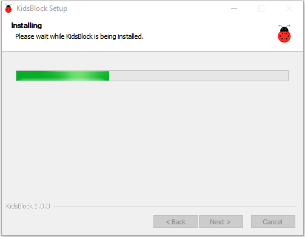

5. After completing the installation, click "**Finish**" to open Kidsblock.

6. If there is a warning, just click "**Allow access**" to re-open Kidsblock.

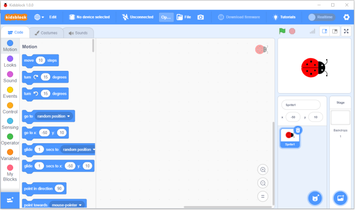

------

### MacOS System

1. Kidsblock Package Download: [http://xiazai.keyesrobot.cn/KidsBlock.dmg](http://xiazai.keyesrobot.cn/KidsBlock.dmg)

2. After downloading, click KidsBlock. Drag **KidsBlock Desktop** into File **Applications**. 

3. After installation, you will see KidsBlock icon: 

   

4. Tap KidsBlock. If it cannot be opened, we shall modify some computer settings. It is because that, by default, Mac Book only opens software from App Store.

   

5. Open **Settings** and click **Privacy & Security**. Tick "**App Store and identified developers**", and tap "**Open Anyway**". 

   

6. Click **Open**. 

   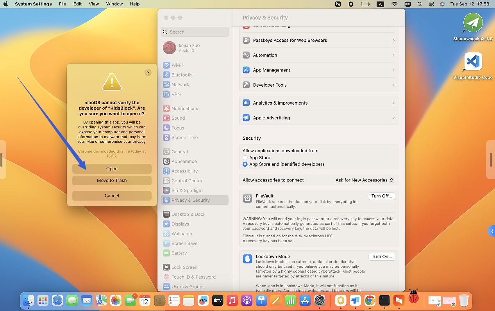

7. After settings, Kidsblock can work normally. 

   

8. Here is the main page of Kidsblock. Now enjoy your programming journey! 

   

------

### Kidsblock Startup

**Here we demonstrate on Windows.**

#### Overall Function Description 1: Toolbar

------

##### Select Language

Click  to choose a language: 

------

##### Install Driver

**NOTE: If you computer is already installed a driver, please skip this step. If not, please operate as follows.**

- Click  to choose “**Install driver**”.

- Pop up a "Device Driver Installation Wizard", and click “**Next**”.

- Click “**Finish**”.

- “**Next**”.

- And “**Finish**”.

- If there is a warning, click “**Allow**” and “**Install**”.

- After installing successfully, click “**Finish**”.

- Click “**Extract**”.

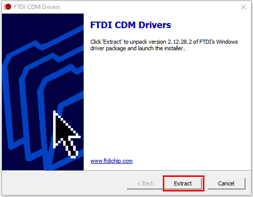

- “**Next**”.

- Tick “**I accept this agreement**” and “**Next**”.

- After completing installation, click “**Finish**”.

- Click “**INSTALL**”.

- Then “**OK**”.

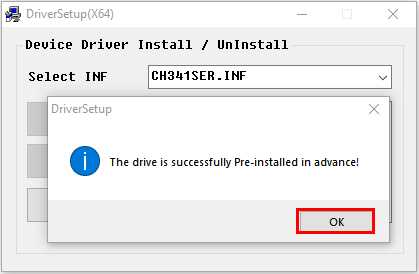

------

##### Select a Hardware

###### Board And Port

- Click  to select a main control board. 

- Click **Kit** to choose **RGB LED cube**. All needed sensors are integrated in this kit, so that you do not have to add them by yourself. 

  

- Import the kit and back to main page, and you will see a interface with all connectable devices. Find the correct one to **Connect**. 

  

- **Go to Editor**. 

  

- Main interface: 

  

###### Disconnection

- Click  firstly.

- Then click **Disconnect**. 

  
  
  

------

##### Overall Function Description 2: Areas

------

##### Add Modules

**NOTE: All needed modules are integrated in this kit, so you may skip this part. If you want to use some sensors which are not included in this kit, please take this section as a reference.**

- Click .

- Choose an extension.

  

- Take passive buzzer as an example. Click **"Passive buzzer"**. 

  

- “**Not loaded**” is shifted to “**Loaded**”, and this sensor codes is successfully imported.

  

- Click  to back to editor, and you will see the Passive buzzer blocks. 

  

- If you want to delete this extension, click . 

- Find and click passive buzzer. 

  

- “**Loaded**” becomes “**Not loaded**”, and it is removed from blocks. 

------

#### Open Codes

##### Method Ⅰ

- If Kidsblock is closed, click SB3 files to directly open the code. For instance, click  to open it, and choose the correct board and port. 

  

#### Method Ⅱ

- Click “**file**” and choose “**Load from your computer**”.

  	

- Find the SB3 file on your computer, like . 

  

  
  
  

------

#### Upload Code

- Import  to Kidsblock.

- Connect the board to your computer and choose the corresponding port, click . 

  

- Wait for uploading.

  
  
  

------

#### Set Baud Rate

- Set the print box at the right-upper corner: 
  - Small print box: 
  - Large print box: 
  - No print box: 

- Click  to set baud rate. 

  

- Then you will see “**Hello KidsBlock**” is being printed in the box. 

------

------

## 2.Product Assembling

------

### Step 1

#### 1.1 Required Components

------
#### 1.2 

There are four holes on the main control board for connecting M3 screws and copper pillars. 

------
#### 1.3

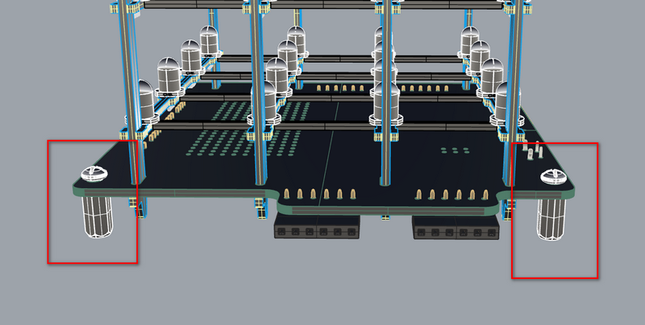

------
### Step 2

#### 2.1 Required Components

------
#### 2.2 

Please pay attention to the direction of the acrylic board. Align the arrowhead to the USB side, as follows: 

Fix the board with four M3 screws. 

------

#### 2.3

------

### Step 3

------

#### 3.1 **Required Components**

------

#### 3.2 

Plug the little bumps into the square holes on Acrylic Board B: 

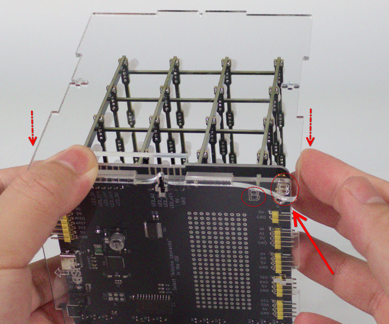

------

#### 3.3

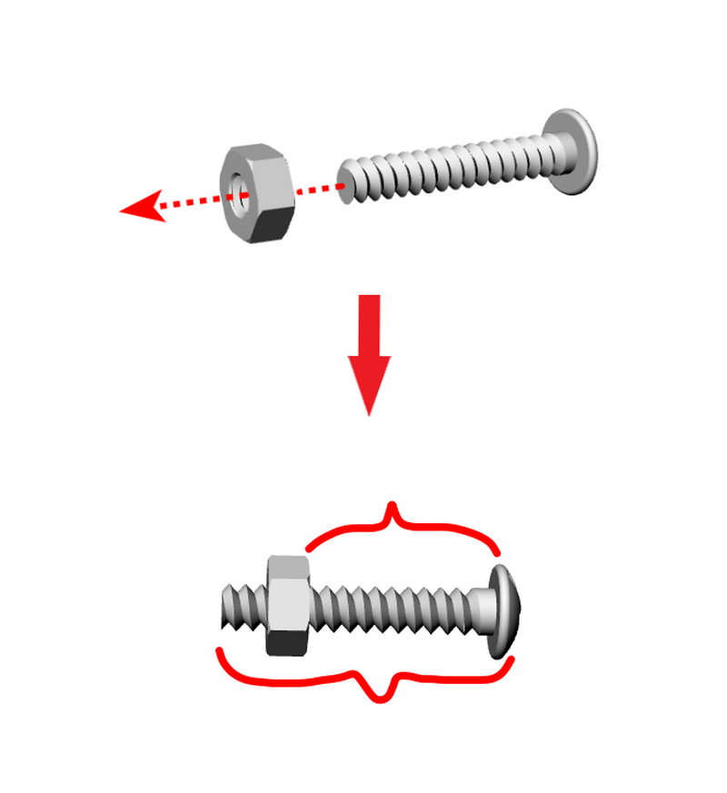

------

#### 3.4

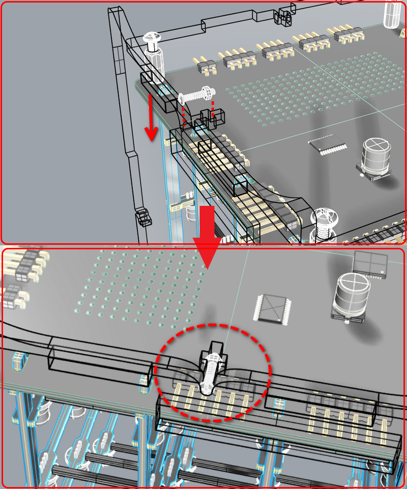

------

#### 3.5 

Hold the screw and tighten it with the screwdriver. Note that do not tighten it too much. 

------

#### 3.6

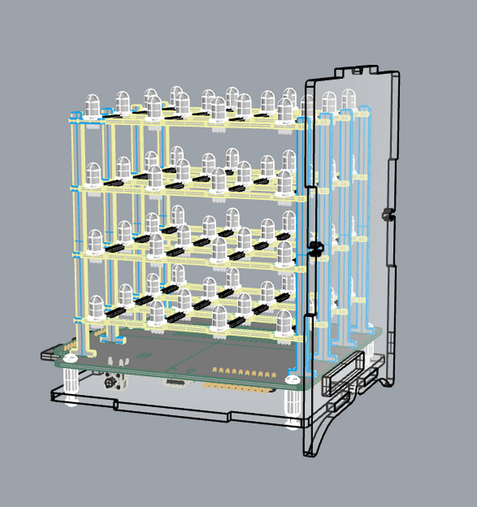

------
### Step 4

#### 4.1 Required Components

------

#### 4.2

------

#### 4.3

Mount the Acrylic Board C: 

.jpg)

------

#### 4.4

------

#### 4.5

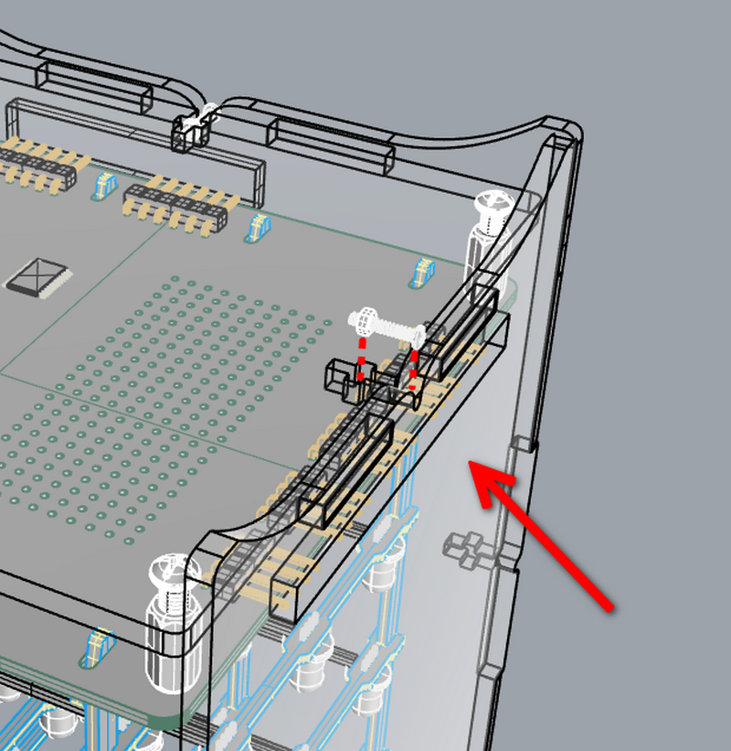

------

#### 4.6

------

#### 4.7 

Hold the screw and tighten it with the screwdriver. Note that do not tighten it too much. 

.jpg)

------

#### 4.8 

Use screws and nuts to fix the Acrylic Board B and C. 

Hold the screw and tighten it with the screwdriver. Note that do not tighten it too much. 

.jpg)

-1695091470175-14.jpg)

------

### Step 5

------

#### 5.1 **Required Components**

------

#### 5.2

Moung the Acrylic Board D. 

.jpg)

------

#### 5.3

------

#### 5.4

------

#### 5.5 

Hold the screw and tighten it with the screwdriver. Note that do not tighten it too much. 

.jpg)

------

#### 5.6 

Use screws and nuts to fix the Acrylic Board C and D. 

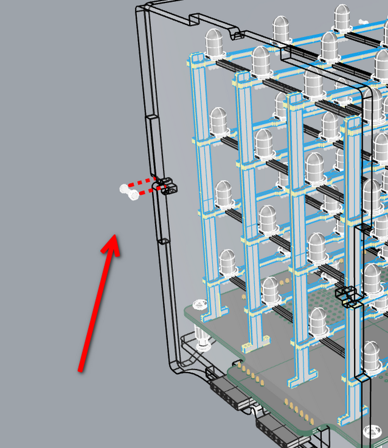

------

#### 5.7

.jpg)

.jpg)

------
### Step 6

#### 6.1 Required Components

------

#### 6.2

编号A的亚克力对其，底部亚克力板的编号A

.jpg)

------

#### 6.3

------

#### 6.4 

Use screws and nuts to fix the Acrylic Board A and B. 

.jpg)

------

#### 6.5 

Use screws and nuts to fix the Acrylic Board A and D.

------

#### 6.6

.jpg)

------

### Step 7

#### 7.1 Required Components

------

#### 7.2 

Please align the holes for screws when installing. 

.jpg)

------

#### 7.3

.jpg)

------

#### 7.4

------

#### 7.5

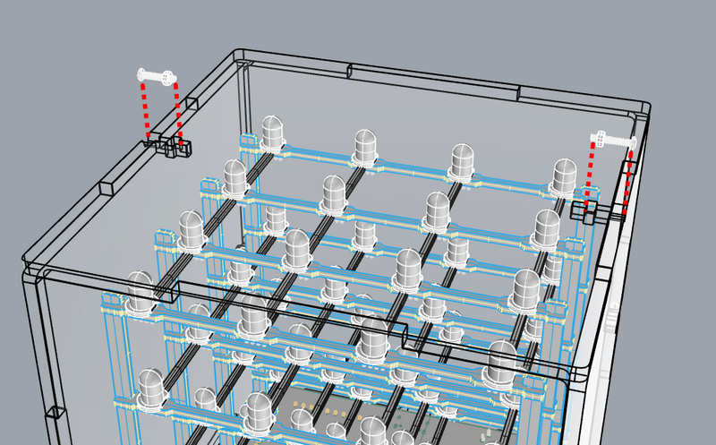

------

#### 7.6

.jpg)

.jpg)

------

###  Completed!

------

------

## 3.Projects

### 3.1. Startup: An Adventure in The World of Light

------

In this project, we will guide you to explore the fantastic cube on its structure, working principle and applications. Now build your cube to get your journey started! 

------

#### Brief Introduction: What Is An RGB Cube? 

A 4x4x4 RGB Cube consists of 64 RGB (tricolor of red, green and blue) LED and their drive circuits, a microcontroller(MCU), and its transparent housing (acrylic board usually). Each LED, separately, emits any color in RGB, hence polychrome patterns and colorful shows can be devised with your creativity through different color combinations. 

------

#### Basic Construction: What Is The Cube Composed?

RGB Cube integrates ATmega32u4 as its main control chip at the bottom to control all 64 RGB LED, whose using method is entirely the same as the Leonardo development board. 

[How to Get A Leonardo Development Board]:https://www.keyestudio.com/products/keyestudio-atmega32u4-leonardo-r3-development-board-1m-micro-usb-cable-for-diy-project

This cube consists of totally 4x4x4=64 LED.

To expatiate, four 4x4 matrix are piled one above another to form a 3D Cube. Still, each sole RGB LED can be controlled to light up in planed colors. 

Similarly, each matrix can also work separately.

Certainly, you can choose to light up all RGB LED on the cube. 

----------------------

#### Working Principle: How Does The Cube Work?

For short, all the RGB LED and their colors' permutation and combination are controlled by an MCU.

Due to the considerable RGB LED, it is unrealistic to control them via IO pin on mainboard one by one. By comparison, a drive circuit satisfies the need --- it is called MCU 32U4+MY9262 Driver Module.

With 32U4, data is transmitted to the driver module to run commands of lighting up each RGB LED, so that the cube is in a light show. 

------

#### Unlimited Ingenuity!

In this project, we get a preliminary understanding of the concept, composition and working principle of the cube, which lays a solid foundation for the following exploration and originality!

Next, please continue your learning on its applications and operational skills! Whether you are a beginner or an experienced developer, learning Arduino will be very joyful and challenging. 

Let’s keep going!

------

### 3.2.Shining Journey: A Unique Cube

---------

First of all, you will learn Arduino programming to know how to light up LED lights and to control the cube via code. Implementing simple light shows, gives you the foundation to explore more creative control methods.

------

#### First Experience: Light Up The Cube

##### Background Knowledge

In terms of hardware, it communicates with the driver module through the 32U4 main control chip to control 64 RGB LED, which simplifies the IO pins on the main control chip.

**The operation guide of driver module MY9262:**

------

**Communication Command:**

|    Instruction Name    | Number of DCK Pulses when LAT is at High |                     Function Description                     |
| :--------------------: | :--------------------------------------: | :----------------------------------------------------------: |
|       Data Latch       |                  0 or 1                  | Strobes image data into temporary registers. In this time, constant current outputs are not updated to a new frame data. |
|      Global Latch      |                  2 or 3                  | Strobes image data from temporary registers   into an APDM/PWM generator. In this time, constant current outputs are updated to a new  frame data. |
|    Reading Command     |                  4 or 5                  | Read out command data from the command latch cell to the 16bits shift registers. And thecommand data could shift out from DO pin by  serial DCK pulses. |
|    Writing Command     |                 10 or 11                 | Strobes command data from the 16bits shift register into the command latch cell. Note that this instruction must follow by the “Enable Writing Command” instruction. |
| Reset APDM/PWM Counter |                 12 or 13                 | This instruction will reset APDM/PWM counter to synchronize a new frame if CMD[11]=”H”. |
| Enable Writing Command |                 14 or 15                 | This instruction enables the “Writing Command”instruction. This instruction should be executed before the “Writing Command” instruction every time. |

------

**Command Operation:**

- Data Latch ：

  

- Global Latch ：

  

- Reading Command ：

  

- Writing Command ：

  

- Reset APDM/PWM Counter (set CMD[11]=”1”)：

  

---------------

**Command Data Format** ：

------

**Data Bit:**

------

**Image Data Format**：

------

**Data Transmitting Protocol** ：

- **MODE0** ( CMD[15]=“0” ) 

  

- **MODE1** ( CMD[15]=“1” ) 

  
  

----------------

**Data Synchronization** ：

- **Auto Synchronization** ( CMD[10]=“0” )

  

- **Manual Synchronization** ( CMD[10]=“1” )

  
  

-----------

On the basis the previous theory, data will be sent according to the register information of MY9262, and that is how the driver module communicate. For beginners, libraries and tutorials are provided to make operations easier.

------

##### Description of Library

Open Arduino IDE to import the Cube libraries. 

--------------

- Initialize.

  

- Light up all RGB LED

  - 1.All LED in one color

    

  - 2.All LED in RGB color

    

- Light up single LED in RGB color in axis x, y, and z

  

  

- By line segments: Given positions of Point A(X1,Y1,Z1) and B(X1,Y1,B1), the RGB LED between A and B will light up.

  1. 

  2. 

  

- By solid squares: 

  1. 

  2. 

     Light up a 4x4 matrix: 

  

- By sphere: Given the position of Point A as a center, draw a sphere with a variable size.

  NOTE: The sphere will not show up if its size is too big or small.

  1. 

  2. 

  

- By box: Given the position of Point A as the starting point, draw a box with a variable size.

  NOTE: The box will not show up if its size is too big or small.

  1. 

  2. 

  

- 11 light effects are included.

  
  
  

------

#### Lighting-up Codes

##### RGB LED at the Original Point Blinks

- Initialize

   

- Light up a RGB LED at (X0,Y0,Z0)

   

- Turn off all RGB LED, NOTE: When lights out, it only can turn off all RGB LED rather than only one of them.

   

Complete code: 

------

##### All RGB LED Blink

- Initialize

  

- Light up all RGB LED in blue. 

  

- Turn off all RGB LED, NOTE: When lights out, it only can turn off all RGB LED rather than only one of them.

  

Complete code: 

------

#### Beginner: Light Effects

##### Water Flow LED on Axis

- Find **Variables** and click **Make a Variable**.

  

- Define a mew variable as x.

  

  

- Initialize

  

- In **forever** block, set x to 0, and repeating times to 4.

  

- Add a **Single LED** block and put the variable x in axis x. Set display color in red 255, green 0, blue 0. And delay 1s. 

  NOTE: Put the **Single LED** block above the **change by 1** block (x adds 1).

  

- After **repeat** block, clear the RGB LED color display, so that it is convenience for observing. 

  

- Upload code to the cube, and you will see a single line water flow LED.

  

  

- Water flow LED on three axis. 

  Add a variable i and three **Single LED** block. Put i into axis X, Y and Z, and set their colors. 

  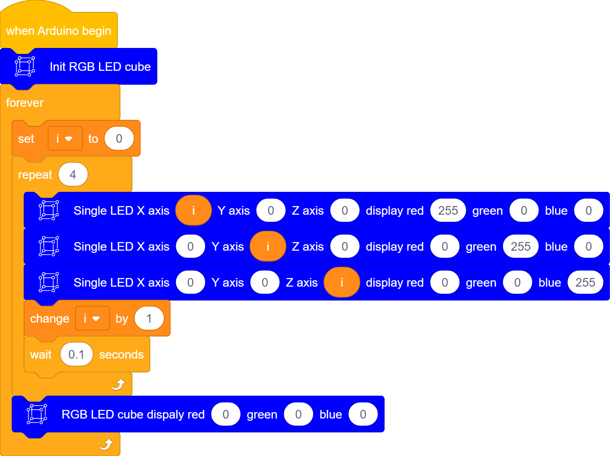

  

##### Water Flow LED on Plane

- Initialize

  

- In **forever** block, define a variable i and set repeating times to 4.

  

- In **repeat** block, add a **Plane cube** block and set i as direction. Set color to red 0, green 255, blue 0, and put a **change by 1** block under it. Delay 1s. Now a water flow LED is on axis X.

  

- After **repeat** block, clear the RGB LED color display, so that it is convenience for observing. 

  

- Water flow LED on three axis.

  Define a variable i and three **Plane cube** block. Put i into axis X, Y and Z, and set their colors.

  
  
  

------

#### Deep Experience: Light Up Cubes

**Cascading interfaces are reserved on the cube, which can connect multiple cubes in series. In cascade mode, only one cube is the master device that controls lights, while others are slave ones that need to clear codes and are not allowed to run codes, otherwise tests are with no results). **

The cascading interface, as follows, can be quickly connect via pins and connectors.

NOTE: Each cube contains many RGB LED and then loads a large voltage. Therefore, when multiple cubes are cascaded, please provide independent power supply to each to ensure stable operation of the system.

Two cubes are cascaded as follows:

------

#### FAQ

##### Q: How to determine the axis X, Y, and Z on the RGB Cube?

A: The direction of the X and Y axis is marked on the main control board, and the Z axis is perpendicular to them.

##### Q: With multiple RGB Cube connected, error occurs.

A: The master RGB Cube is used to control the lights. Please clear their codes in other connected Cubes.

---------------

### 3.3.Magical Fingertip: Button And Light

---------

In this project, a button module is integrated with this cube to control lights through programming, and codes will be written according to the working principle of this button module. With an external button, you may enjoy more joy and feel more involved in the entire experiment, and you will take sophisticated controlling methods much easier with the experience of this lesson. 

------

#### A Button Module

##### Description

**Button module** is a simple input device whose power level is read by the MCU to determine its state (being pressed or released).

##### Principle Diagram

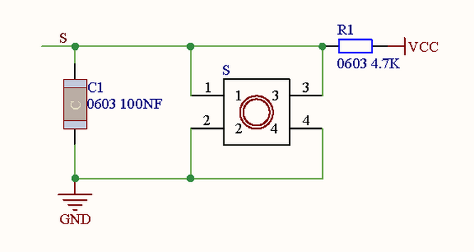

##### **Parameters**

- Voltage: 3~5V
- Current: ≤1.1mA
- Power: ≤5.5mW

**The button works due to a built-in ON/OFF circuit. **

- **When the button is pressed,** the circuit is closed(ON state) so that current passes from the button to GND, and a low power level is detected at the digital input pin on the development board. 
- **When the button is released,** the circuit is opened(OFF state) and the power level is pulled up by a resistor, thus the digital input pin detects a high level. 

------

#### Wiring Diagram

Hold your RGB CUBE and look for the expansion interface at its bottom. Connect the wire to D6 pin. 

**NOTE: S(Signal) is in yellow, V(Voltage) is in red, GND is in black. When wiring, please pay attention to the color and do not reverse!**

------

#### Code

- Initialize. Set pin 6 to input mode. 

  

  

- Initialize the serial port. 

  

- If the read button value is 1, print 1, or else, print 0. 1 means the button is released. 

  

- Button values will be printed on the serial monitor. 

  - When the button is pressed, the monitor prints 0.

  - When the button is released, the monitor prints 1.

------

#### Expansion

**Self-locking Button**

A self-locking button will not pop up after you pressing it until you press it again, which is very similar to a switch. We adopt MCU to control the state of the circuit, and we reform the common button into a self-locking one via coding. 

Code: 

- Initialize, and set pin mode and baud rate.

  

- Define a variable b and set b to 0. 

- In **forever** block, detect the value at pin 6. Here we define 1 as that the button is released. We add a **not** block for negation and a delay of 20ms, which aims to eliminate the button jitter. 

  

- Add another **if** block in the exist one to determine the button value. (The previous one is used to eliminate the button jitter.)

  

- If the button is pressed, set b to 0, or else, set b to 1.

  

- Print b. 

  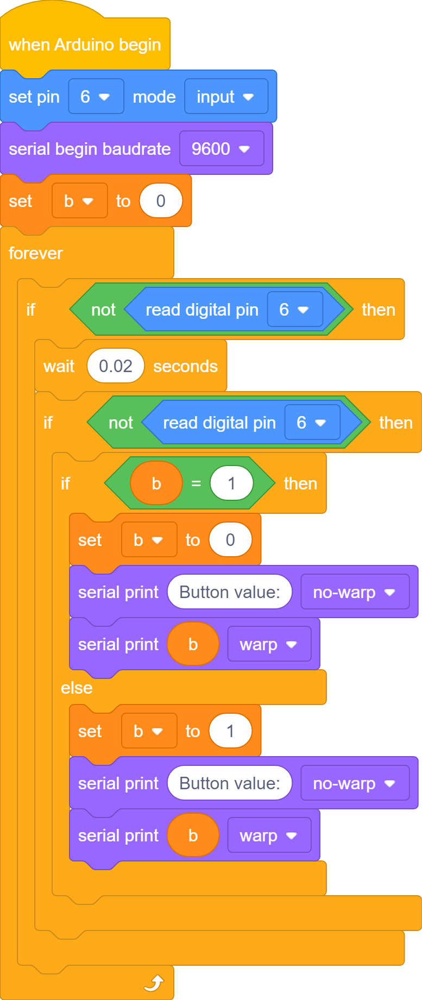

  - In serial monitor, when you press the button, b will be printed more than once. 

    In the code, the button value is always being detected. When you press the button, the value is always 0, because the code will be circulated till value equals 1. So, we must add an **wait until** block to determine whether the button value is 1.

    

    Then, when you press and hold the button, the code will not run repeatedly.

  Complete code:

  

Upload code and open the serial monitor. When you press the button, button value is 1. Press again and it will become 0.  Now it becomes a self-locking button! 

------

#### Button Switches Light

##### Light Color Change

Press the button to shift the overall color of the cube. 

- Initialize.

  - Set pin 6 to input mode
  - Define a variable b and assign it to 0
  - Initialize RGB CUBE

  

- Build a self-locking button code.

  

- Make a block named button.

  

  

- In the self-locking button code, b adds 1 when the button is pressed once, and b circulates within 0~3, so that the button is able to control the lights.

  

- Put the function in the **forever** block.

  

- Add an **if** block and put a **display** block under it. 

  

Complete code: 

------

##### Water Flow LED Change

The button can change the direction of the "water flow". 

- Initialize

  

- Add a button code. 

  

- In **forever** block, put three **if** block to represent axis x, y and z. The button will change the water flow in all three axis. 

  ​	

- Add water flow LED on axis x, y and z.

  

  

  

  

- Add the water flow LED code in the function, and add variable x in circulation. Variable x adds 1 for each time.

  

- Add a **Plane cube** block. Define x as direction and set display color.

  

- Water flow LED  on three axis

  

Complete code: 

------

#### FAQ

##### Q: RGB Cube detects the button in a poor sensibility. 

A: Try to modify the delay time of jitter elimination to an appropriate time.

##### Q: Serial monitor does not print values.

A: 

1. Please check whether the serial port is correct. 
2. Please check whether the baud rate is consistent with that in the code.
3. Re-plug the USB cable. 

------

### 3.4.Symphony of Colors: Innovation in Art of Light

------

**TARGET:** We will learn how to design and innovate the light effects and how to fade, blink and circulate light color.

------

#### Charm of Fading Color

##### Fade RGB LED

To fade an LED, we control the gradual change of LED brightness through the PWM output by the MCU. 

**Pulse Width Modulation (PWM)**, is an effective technology using the MCU digital output to control analog circuits, which is applied to many fields, including measurement, communication as well as power control and conversion.

**Pulse Width Modulation**

Pulse  Width Modulation, or PWM, is a technique for getting analog results with digital means. Digital control is used to create a square wave, a  signal switched between on and off. This on-off pattern can simulate  voltages in between the full VCC of the board (e.g., 5 V on UNO, 3.3 V  on a MKR board) and off (0 Volts) by changing the portion of the time  the signal spends on versus the time that the signal spends off. The duration of "on time" is called the pulse width. To get varying analog  values, you change, or modulate, that pulse width. If you repeat this  on-off pattern fast enough with an LED for example, the result is as if  the signal is a steady voltage between 0 and VCC controlling the  brightness of the LED.

Official Website: https://www.arduino.cc/en/Tutorial/SecretsOfArduinoPWM

PWM includes several uses:

- Dimming an LED.
- Providing an analog output; if the digital output is filtered, it will provide an analog voltage between 0% and 100%.
- Generating audio signals.
- Providing variable speed control for motors.
- Generating a modulated signal, for example to drive an infrared LED for a remote control.

**The provided CUBE library includes the PWM method, so we can directly use to control RGB color within the value of 0~255.**

The main control chip sends a command, and MY9262 driver module outputs PWM value to control the RGB LED. 

##### Code

- We adopt **for** loop, which accumulate RGB from 0 to 255 so that RGB CUBE is gradually brighter.

- We adopt **for** loop, which decreases RGB from 255 to 0 so that RGB CUBE is gradually dimmer.

Complete code: 

Code for gradual change in RGB color: 

------

#### Vision of Random Blinks

We input random numbers to make some unexpected and interesting light effects.

- **Pick random** block:

  

- Add three variables R, G and B, and set random number range within 0-255.

  

  

- Light up a single RGB LED. Set axis to random 0-4 and color to R, G, B. Add a delay.

  
  
  

------

#### Integration Show of Light

- BOX

- BOX and Sphere

### 3.5.Glamour of Rotation: Potentiometer Plus Cube

In this project,  a potentiometer is extended to the cube to control the RGB LED. 

----------

#### Potentiometer

##### Description

A potentiometer, also called rheostat, is an electronic component used to control current or voltage by adjusting its resistance value. Its resistance changes with a rotation so that the current changes according to *Ohm's Law*.

##### Principle Diagram

-------

#### Potentiometer and Cube

**NOTE: S(Signal) is in yellow, V(Voltage) is in red, GND is in black. When wiring, please pay attention to the color and do not reverse!**

------

#### Code

Upload code to the development board and open the serial monitor to set baud rate. Rotate the potentiometer and you will see the value on the monitor is changing.

------

#### "Rotate" Light!

We can adjust lights via the map value.

Initial value: 0-1023

Map value: 0-255. It is converted from the initial value. 

##### 1. Change the color of RGB LED

- Initialize

  

- Add a **map** block. The read value A1(0~1023) is mapped to 0-255.

  

-  Create a variable **ananlogvalue** and map its value as its assignment. 

  

- Print the map value and set display RGB color.

  

##### 2.Change the position of RGB LED

- Initialize

  

- Add a **map** block. The read value A1(0~1023) is mapped to 0-3, which respectively means the coordinates on axis x, y and z.

  

- Create a variable **ananlogvalue** and map its value as its assignment. 

  

- Print the map value and set display RGB color and axis x, y and z.

  
  
  

------

In this experiment, a potentiometer is extended to the cube to control the RGB LED. We design light effects through rotating the potentiometer whose value is read by coding. Herein, you may feel more joy and interactivity, and these experience will set you up for your future exploration in cube extension.

--------------

### 3.6.Ambient Resonance: The Wisdom of Light

In this project, a photoresistor is integrated with the cube to change the light effects according to the ambient light.

--------

#### Photoresistor

##### Description

A photoresistor, also called photosensor, is an electronic component that converts light signal into electrical signal(voltage, current, resistance, etc.) through a kind of optoelectronic part. The core of this module is a built-in resistor whose value can be influenced by light.

##### Working Principle

The photoresistor is arranged in the circuit in series. After putting an appropriate voltage at both ends, when there is no light, the resistance value closes to be infinite, so the circuit can be regarded as opened. By contrast, the resistance will decrease if there is light, thus the current increases. With the light intensity up, the resistance is so low that causes a short circuit.

Next, we write code to read the value of the photoresistor through ESP32 development board.

##### Principle Diagram

Put a light on the photoresistor. 

The brighter the light is, the lower the resistance value will be, and the greater the voltage(from VCC to the photoresistor) will be. 

##### Parameters

- Voltage: 3~5V
- Current: 0.2mA
- Power: 1mW
- Spectral peak: 540nm
- Bright resistance (10lux): 5~10KR
- Dark resistance: 0.5MR

------

#### Photoresistor and Cube

**NOTE: S(Signal) is in yellow, V(Voltage) is in red, GND is in black. When wiring, please pay attention to the color and do not reverse!**

------

#### Code

- Initialize

  

- Add two variables **analogvalue** and **mapvalue**. Assign the read value on photoresistor to **analogvalue** and map value to **mapvalue**. 

  

- Print the two values.

  

Upload the code to development board and open the serial monitor to set the corresponding baud rate. Try to use your hand to cover the photoresistor, you will see the value printed on the monitor slumps.

---------

#### Ambient Light and Cube

1.RGB Cube changes with the ambient light.

- Initialize

  

- Add a **map** block. The read value A1(0~1023) is mapped to 0-255.

  

-  Create a variable **ananlogvalue** and map its value as its assignment. 

   

- Print the map value and set display RGB color.

  

2.The brighter the ambient light is, the more LED on RGB CUBE will be on. 

- Initialize

  

- Add a **map** block. The read value A1(0~1023) is mapped to 0-255.

  

- Create a variable **ananlogvalue** and  map its value as its assignment. 

  

- Determine the brightness

  - If **analogvalue** ＞ 200, light up RGB LED in the first floor.
  - If **analogvalue** ＞ 400, light up RGB LED in the second floor.
  - If **analogvalue** ＞ 600, light up RGB LED in the third floor.
  - If **analogvalue** ＞ 800, light up RGB LED in the forth floor.

  

Complete code:

------

In this project, a photoresistor is integrated with the cube to change the light effects according to the ambient light. The cube automatically lights up in accordance with the ambient light by reading the sensor value. Herein, the cube features adaptability and intelligence, and you may gather experience in exploring the external environment.

-------------

### 3.7.Rhythm of Sound: Voice Control

In this project, a sound sensor is integrated with the cube to control the light by voice. 

-----------

#### Sound Sensor

##### Description

Sound sensor is equipped with a microphone to detect the sound volume around its surroundings. After its detection, analog signals are output and converted into analog digital signal (AD Collect) within the voltage of 3.3V ~ 5V. 

The sound sensor is applied to various conditions, such as interactions via sound volume, voice control robots, voice control switches, as well as alarm systems that are triggered by sounds. 

##### Principle Diagram

------

#### Wiring Diagram

**NOTE: S(Signal) is in yellow, V(Voltage) is in red, GND is in black. When wiring, please pay attention to the color and do not reverse!**

------

#### Code

Upload the code to the development board, and open the serial monitor to choose the correct baud rate. Clap or pound your desk to make noise, and the sound sensor converts the detected analog signal into digital ones, so you will see the output value changes on the monitor.

You can rotate the potentiometer on the sound sensor to change the value of the output analog signal.

-----------

#### Voice Control Cube

When the sound sensor detects higher sound volume, the RGB cube will show richer and brighter colors.

This change in brightness and colors will be coordinated with the volume of the sound, forming a harmonious rhythm. In short, sounds will directly affect the light effects of the cube. Enjoy your wonderful show!

- Initialize. 

  Create a variable **analogvalue** and map its value as its assignment. 

  

- Create three functions to accomplish three kinds of light effects respectively at a high, medium and low sound volume.

  

- Function **tuning1** achieves the light effect at low volume. 

  - Define a variable **time** as the change speed of the lights. RGB LED will light up from the first floor to the second one, and then they are gradual off. It likes musical rhythm.

  

  - If 15＜**analogvalue** ＜40

- Function **tuning2** achieves the light effect at medium volume. 

  

- Function **tuning3** achieves the light effect at high volume. 

  

Complete code: 

------

In this project, a sound sensor is integrated with the cube to control the light by voice. The board reads the value output by the sensor and automatically adjusts its lights according to the sound rhythm and volume. In this way, you may enjoy much fun of the integration between the light and sound, gathering experience in exploring the external environment. 

------------

### 3.8.Light Creation: Freaking Awesome Light Effects

#### Color Fader 1

Code:

------

#### Color Fader 2

Code: 

------

#### Tuning

Code: 

------

#### Frame

Code:

------

#### Heartbeat

Code:

------

#### Rainstorm

Code:

------

#### Random Colors

Code:

-------------

------

## 4.FAQ

### Q: Is only USB interface for powering RGB CUBE USB?

A: Despite that, we also provide with 2.54mm pin power interface as power input. 

### Q: An error occurs when the board is burning code.

A: 

- Please check whether the USB port number is consistent with the connected one. 
- Please check whether you choose the correct board. 

### Q: Is RGB CUBE extended to other modules? 

A: Yes. External modules can be connected to the kit via the 2.54mm pin interface. For details, please see main board pin description to ensure normal work. 

